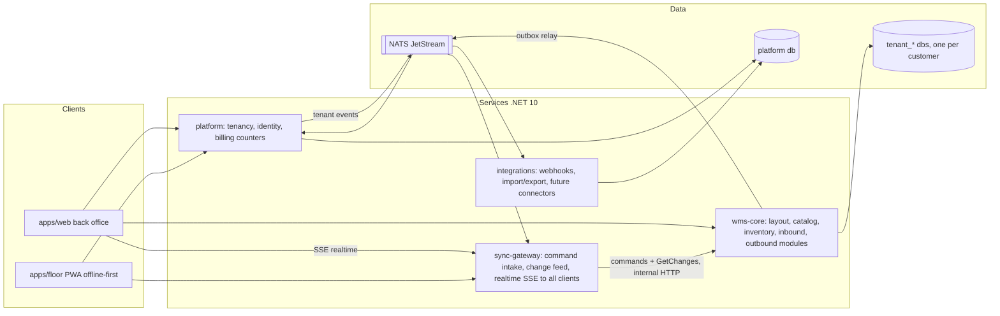
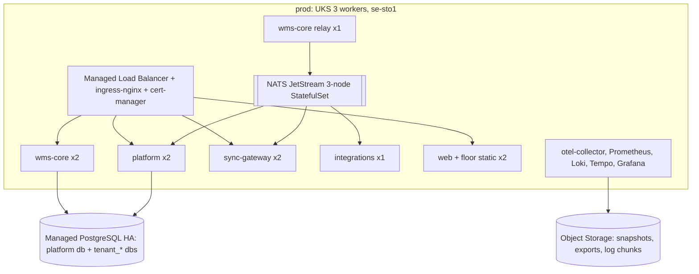
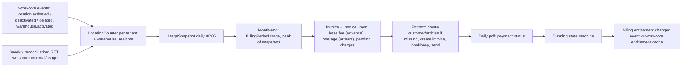
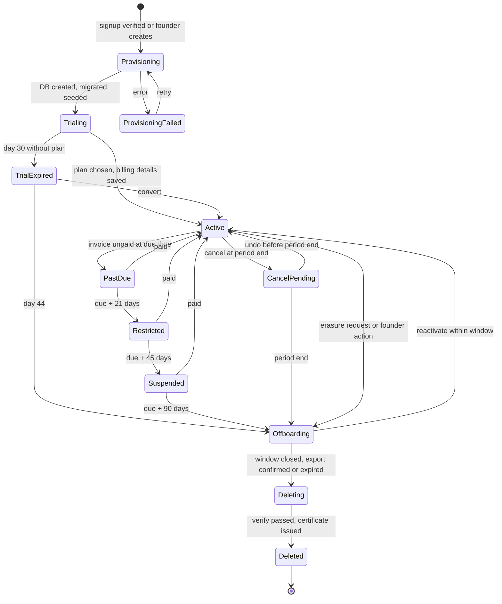

# Lagerkraft: Architecture and Foundation Design

Date: 2026-09-05. Status: approved; founder review gate closed 2026-09-12. Source: brainstorm board (four photos from the planning session), the Epixx POC under `Epixx/`, and a design session that settled each area in turn. Sub-project 0 gets its own implementation plan from this document.

Reviewed use case by use case on 2026-09-05 (14 flows: signup, mapping, CSV import, shared scanner, inbound, move/count, outbound, deviations, realtime + deploy, returning device, dunning, offboarding, restore, SSO/roles/support). Fixes accepted in that review are folded into the sections below. Cross-cutting principles that came out of it: **the floor is the truth** (physical facts are accepted, rule breaches become deviations), **client-generated ids** for everything a device creates, **authorization at `occurred_at`**, **state denials are batch-level holds, never per-command rejections**, and **every tenant object lives under `tenants/<tenant_id>/`**.

## Decisions locked in this session

- Product: Lagerkraft, multi-tenant SaaS we host, priced per storage location / m².
- Data isolation: **one Postgres database per tenant** plus a small platform database.
- Floor app: **offline-first PWA** now, Capacitor wrapper for rugged Android scanners later, same Vue bundle.
- Team: 2-4 developers, plain containers + managed Postgres + NATS, portable to any cloud. Recommended host: UpCloud se-sto1 Stockholm (EU-owned), see Production deployment architecture.
- Shape: **coarse services with NATS JetStream from day one** (4 services, listed below). wms-core keeps layout/catalog/inventory/inbound/outbound as in-process modules sharing one tenant DB so stock movements stay in local transactions.
- Offline sync: **own command log + change feed** on plain Postgres, no third-party sync engine.
- First pilot scope: full loop, goods in -> stored -> picked -> shipped. No e-commerce/bookkeeping connectors yet, but the event/webhook design leaves room.
- **Starting code: [Epixx](../../../Epixx/)**, the POC project folder in this repository. Keep it frozen and runnable as the domain reference. Do not grow the Razor/jQuery/SQL Server app into the product. Extract the pallet flow, spot reservation, height-fit putaway, and claim-work concurrency into wms-core.

## Starting from the Epixx POC

Epixx is a .NET 10 ASP.NET MVC app (`Epixx/Epixx.csproj`) with Razor, jQuery/Bootstrap, EF Core 10 on **SQL Server LocalDB** (`Server=(localdb)\\mssqllocaldb;Database=EpixDB`), cookie Identity, and a hosted reservation-cleanup job. Default login after seed: `admin@test.com` / `Admin123!`. Roles today: `Admin` and `Driver`.

### What we keep (domain)

- Pallet states: `AwaitingStorage` -> `Stored` -> `PalletTransfer` / `PackingAreaTransfer`.
- One pallet per `PalletSpot`, timed reservation (`ReservedByDriverId`, `ReservedUntil`) plus `ReservationCleanupService`.
- Height-aware placement: spot `Height` vs pallet/type height (cm in the POC).
- Location codes of the form row + bay + level (`RA 101 1`), generated in `WarehouseService` from row blocks with mixed height profiles. That generator is a stand-in for the mapping wizard, not the production way to create a warehouse.
- `PalletType` as the first article-like catalog (description, width/height, amount, weight, `Category`).
- Driver task queue (`InboundLogistics` vs `Auto`) and claiming a batch of work.
- Optimistic concurrency (`RowVersion` on pallet and spot).
- Outbound destination as `Store` + `LoadingDock` with a confirmation code.
- Identity as the seed of local accounts; map `Admin` -> `tenant_admin`, `Driver` -> `floor_worker`.

### What we do not keep as product shape

- SQL Server and T-SQL locking (`ROWLOCK, READPAST, UPDLOCK` in `PalletService.ClaimPalletsForTransfer`). Postgres equivalent is `FOR UPDATE SKIP LOCKED` inside the command transaction.
- Razor views and jQuery pages. Floor UX is the Vue PWA; back office is Vue web.
- Pallet as the only stock unit. Lagerkraft stock is article + packaging levels + handling-unit LPN; a stored Epixx pallet becomes a handling unit sitting on a bin.
- Single shared database, cookie sessions, `WarehouseService` as a singleton that randomly generates the warehouse on first run.
- Integer `Amount` only; decimal quantities stay as designed.
- The stray root file `Epixx/WarehouseController.cs` (duplicate of the controller under `Controllers/`) is not part of the product.

### Mapping into Lagerkraft modules

- `Row` / `PalletSpot` -> Layout `Location` tree (aisle/rack/level/bin) with `height_mm`.
- `PalletType` -> Catalog article + a pallet `PackagingLevel`.
- `Pallet` + status string -> Inventory `HandlingUnit` + `StockMovement` reasons (receive, putaway, move, pick).
- Spot reservation -> `LocationReservation(location_id, task_id, expires_at)` table plus a periodic sweep, not columns on the location; task assignment carries its own expiry.
- `Driver` current task -> floor worker + `Task` of type putaway/move/pick.
- Claim-work SQL -> outbound/inbound task allocation using `SKIP LOCKED` (the same "don't double-assign" intent).

### How the repo is laid out around it

The Epixx repository itself becomes the Lagerkraft repository (decided 2026-09-05; confirmed on self-review 2026-09-12 — this supersedes the earlier Cursor-plan idea of a parent git at `F:\lagerstuff` with Epixx nested): `master` stays the POC as it was, Lagerkraft work happens on `lagerkraft/*` branches starting with `lagerkraft/sp0-foundation`, and the POC code stays untouched in the `Epixx/` project folder next to the new `backend/`, `frontend/` and `contracts/` trees. Do not copy Razor or `wwwroot/lib` into the new solution. The root `Epixx.slnx` and the stray root `WarehouseController.cs` belong to the POC and are left alone; the new solution is `backend/Lagerkraft.sln`.

### Running Epixx (reference only)

Prerequisites: .NET 10 SDK, SQL Server LocalDB (`(localdb)\mssqllocaldb`; ships with SQL Server Express or as a standalone installer), Git. Then `dotnet restore` and `dotnet run --project Epixx/Epixx.csproj`, open https://localhost:7132, log in as the seeded admin. Docker and pnpm are needed for the new services and Vue apps from sub-project 0, not for Epixx.

## Scope decomposition (each gets its own spec -> plan cycle)

0. **Foundation**: `lagerkraft/sp0-foundation` branch beside the frozen Epixx folder, CI, service template, tenancy + provisioning, identity (local accounts + per-tenant OIDC SSO), device enrollment and PIN unlock, both Vue app shells (back office and floor PWA), outbox + NATS relay, sync skeleton, observability, test infra. Port Epixx claim-work and reservation as the first inventory/task primitives, still behind the new APIs.
1. **Layout & mapping**: warehouse creation with the right parameters, mobile mapping flow, web map view updating live as the floor maps, CSV/JSON import/export, badge unlock (PIN and device enrollment already shipped in sub-project 0), and the **label printing subsystem** (print agent, Bluetooth mobile printing, PDF fallback, location labels in walk order, user badges, constrained template editor; see Labels and barcode printing).
2. **Catalog**: articles, packaging levels (each/package/pallet), pallet types, tenant-defined attribute definitions with generated forms and list columns.
3. **Inventory + inbound**: movement ledger, balances, receipts, putaway tasks with smart suggestion.
4. **Outbound**: orders, allocation, pick tasks, pack, ship confirmation, deviations (model and rules under "Outbound model" below).
5. **Billing**: usage snapshots, month-end invoicing, Fortnox sync, proration, dunning, internal admin. Must ship before the first paying customer's second month; trial handling and the hard cap are already in sub-project 0.

Then pilot. Items 10-31 on the board build on the ledger, tasks and events without new foundations.

## Competitive modularity (how we sell against large WMS)

Lagerkraft wins by being **agile, easy to use, and modular** — not by matching suite sprawl (yard, waves, full labour management). Build and sales share this list.

### Wedge (already in this design)

- **Floor-first, offline-first**: the warehouse keeps working when the network does not; physical facts win (`floor is the truth`); denials are batch holds, not per-tap red errors.
- **Modular core, not a monolith**: `platform` / `wms-core` / `sync-gateway` / `integrations`, with wms-core split into Layout, Catalog, Inventory, Inbound, Outbound (and Printing) behind architecture tests.
- **Configure without consultants**: tenant-defined attributes, packaging levels, location tree, and putaway as a strategy interface — change behaviour without schema rewrites or vendor projects.
- **Integrations at the edge**: webhooks and events; partners never write stock. Headless **command contracts** are the same path our floor PWA uses, so a customer or partner scanner app can plug in without a second API.
- **Honest SaaS packaging**: priced per storage location / m2, soft limits with overage, short pilot loop (goods in, then stored, then picked, then shipped).

### Sellable capability map (aligns to sub-projects)

| Capability | What the buyer turns on | Sub-project |
| --- | --- | --- |
| Foundation | Tenant, identity, devices, sync, thin app shells | 0 |
| Layout | Map warehouse, labels, import/export locations | 1 |
| Catalog | Articles, packaging, attribute templates | 2 |
| Inbound + inventory | Receive, putaway, ledger, balances | 3 |
| Outbound | Orders, pick, ship, deviations | 4 |
| Billing | Usage, invoices, Fortnox, dunning | 5 |

Capabilities light up per tenant as entitlement flags on the subscription (platform-owned). Missing capabilities return **batch holds** with a clear reason — never half-working screens. We do not sell yard, wave planning, or full LMS in the pilot; that is the deliberate non-goal versus lumbering suites.

### Product promises to keep sharp

- **Time-to-first-pick**: named path — enroll device, then map one aisle, then receive one handling unit, then putaway, then pick, then ship handoff — measurable in days, not a multi-month programme.
- **Vertical starters**: ship retail, food/temperature, and industrial attribute + label starter sets at provisioning so onboarding is not a blank canvas (see Modular product fields).
- **Customer-visible ops**: sync health (queue depth, last success, SSE), open deviations by age, and “what’s stuck on this device” are first-class back-office surfaces — trust against black-box enterprise suites.
- **Headless by default**: OpenAPI + versioned command/event contracts; our Vue floor app is the reference client, not the only client.

### Non-goals (say no in sales)

Yard management, wave/waveless orchestration as a product line, full labour management, custom on-prem plugins inside wms-core, and rebuilding ERP/MES inside Lagerkraft. Extend via commands, webhooks, and integrations — not by forking the core.


## System architecture



Service responsibilities and ownership:

- **platform**: owns the `platform` DB schema. Tenants, users, memberships, roles, devices (registry and enrollment), subscription tier and location counters (consumes `layout.location.*` events), plus webhook and import-job tables (see integrations). Provisions a tenant: create DB, run migrations, publish `tenant.provisioned`. Issues JWTs.
- **wms-core**: owns all tenant DB schemas and is the only writer to them. Modules are separate projects (`Lagerkraft.WmsCore.Layout`, `.Catalog`, `.Inventory`, `.Inbound`, `.Outbound`, `.Printing`) with public contracts only; architecture tests forbid cross-module internal references. Applies each command in one transaction that writes the domain change, the `change_log` row, the `outbox` row and a `processed_commands` row (idempotency by command id, so a retried command returns its stored result). A relay publishes outbox rows to NATS (at-least-once with `Nats-Msg-Id`; consumers dedupe by event id). Also runs as `wms-core migrate` (fan-out across all tenant DBs), `wms-core relay` and `wms-core replay`.
- **sync-gateway**: **stateless**. Authenticates devices and users, enforces one in-flight batch per device, forwards command batches to wms-core over internal HTTP, serves `GET /sync/changes?warehouse=&since=` from wms-core's internal change endpoint, and holds the **realtime SSE connections for both the floor app and the back office**: on connect it serves catch-up from `Last-Event-ID`, then streams live `change_log` entries as they arrive on NATS. Scales horizontally by adding instances.
- **integrations**: consumes events, delivers webhooks with retry, runs import/export jobs. It has no database of its own. Webhook endpoints, delivery logs, import jobs and its `processed_events` rows (`consumer = integrations`) live in the platform DB; integrations may write those tables and nothing else. It never writes catalog or stock (wms-core owns those). Later: Fortnox/Visma, Shopify/WooCommerce.

All four are the same service template (one .NET solution, one Dockerfile per service, one CI pipeline). Local dev via .NET Aspire AppHost (Postgres with databases `platform` and `tenant_migrate` for migrator tests, NATS, four services, two frontends) plus a `compose.yaml` for anyone without Aspire. Provisioning creates `tenant_<id>`; there is no local product `tenant_demo` database. The **demo tenant** in Production deployment architecture is a real tenant in prod, used as the migration canary.

## Tenancy and data

- Tenant resolution: `tenant_id` claim in the JWT. Back office also uses `{slug}.lagerkraft.se` in deployed environments. Local Aspire and `pnpm dev` use `tid` only; wildcard DNS is not required to run the stack. The host-header path is implemented and unit-tested.
- Platform catalog stores an encrypted connection string per tenant. Tenants start as databases on one shared server; heavy tenants move to their own server by changing the catalog row.
- EF Core 10 + Npgsql. One `TenantDbContext` type, connection resolved per request. Migrations are applied by the `migrate` command on deploy: platform DB first, then every tenant DB in parallel with a concurrency cap; a failed tenant migration blocks that tenant only and alerts.
- Connection pools: one Npgsql pool per connection string, `Max Pool Size` kept low per tenant (start at 10) and Postgres `max_connections` sized for tenant count; PgBouncer in transaction mode when tenants exceed roughly 50.
- Ids: UUIDv7 everywhere, generated client-side for offline commands.

## Domain model (core entities)

```mermaid
erDiagram
  Warehouse ||--o{ Location : contains
  Location ||--o{ Location : parent
  Article ||--o{ PackagingLevel : has
  PalletType ||--o{ PackagingLevel : used_by
  Location ||--o{ StockBalance : holds
  Article ||--o{ StockBalance : of
  StockMovement }o--|| Article : moves
  StockMovement }o--o| Location : from
  StockMovement }o--o| Location : to
  Receipt ||--o{ ReceiptLine : has
  Order ||--o{ OrderLine : has
  Task ||--o{ TaskLine : has
  Task }o--o| Location : suggested
  Deviation }o--o| Task : raised_on
```

Refinements versus the board, with reasons:

- **Location tree instead of fixed Sektion/Hylla/Hyllrad/Hyllplats tables.** `Location(warehouse_id, parent_id, type, code, path ltree, height_mm, width_mm, depth_mm, max_weight_g, barcode, status)` where `type` is zone/aisle/rack/level/bin/floor/dock/staging. Same mapping flow, but docks, floor spots and staging areas fit, and pallet racks versus shelving are just parameters. Code pattern per warehouse, for example `{aisle}-{rack:2}-{level}-{bin:2}`: numeric tokens declare a width and are zero-padded, and the server rejects any code that does not match the warehouse pattern, so `A-1-3-2` and `A-01-03-02` can never coexist. `Location.aliases[]` (code, expires_at) keeps an old code scannable for 90 days after a label is replaced. Hyllplatsaction becomes the general `change_log`.
- **PackagingLevel instead of Paket and Pall tables.** `PackagingLevel(article_id, rank, name, qty_in_base, dims, gross_weight, barcode, pallet_type_id, is_breakable)`. Every level states how much of the article's base unit it contains, so conversions are one ratio. The board's pick rule becomes: pick the largest level whose `qty_in_base` is <= the remaining requested quantity, and measure by that level's volume. Details in Units of measure and quantities.
- **Modular product fields: tenant-defined attributes** instead of "extra data" tables. Detailed in its own section below; applies to articles and packaging levels first, locations later.
- **Append-only StockMovement ledger** (from, to, article, `qty_base` in the article's base unit, what was entered and in which packaging level, reason, reference, user, occurred_at) with a `StockBalance` table maintained in the same transaction. Every receive, putaway, pick, move and adjustment is a movement. This gives spårbarhet and inventering later without new tables. Invariant tested property-based: sum of movements equals balances.
- **Task** as the floor app's single work object (putaway, pick, move, count) with status, assignee, lines and a suggested location. Sub-project 0 creates `Task` and `TaskLine` (columns below, **no foreign keys** until article and location exist) so claim-work has a real table; nothing fills lines until outbound. **Deviation** (avvikelse) is raised when a command is rejected, a rule is overridden, or a worker reports a mismatch (`kind`: rejected | policy_override | over_receipt | short_pick | damage | count_mismatch | stale_command | reported).
- **Deviation model**: `Deviation(id client-generated, warehouse_id, kind, status open|pending_approval|resolved|dismissed, location_id?, handling_unit_id?, article_id?, qty_base?, command_id?, movement_id?, task_line_id?, reported_by, reported_at, detail jsonb, note, attachment_ids[], resolution, resolved_by, resolved_at)`. For a rejected command, **wms-core writes the deviation in the same transaction that stores the rejection in `processed_commands`**, with the original payload in `detail`; the device only renders it from the change feed. Resolution is a command, `ResolveDeviation(id, resolution, actions[])`, whose actions are existing commands (move to `QUARANTINE`, `write_off` with `inventory.adjust`, recount task, correction, dismiss with note); movements created this way carry `reference_type=deviation`. Rejected commands additionally offer **"apply with override"**, which re-runs the stored payload under the manager's permissions with a `policy_override` marker, so a putaway into a bin that was deactivated while the worker was offline is fixed in one click instead of re-keyed. Attachments: the device resizes photos to 1600 px (about 300 KB), keeps the blob in IndexedDB, the command carries client-generated `attachment_ids[]`, and blobs upload separately to Object Storage via presigned URLs when online (`Attachment(id, status pending|uploaded, object_key)`, 50 MB pending cap per device). Notifications per kind (none, immediate email, hourly digest; defaults immediate for `damage` and `pending_approval`) go through platform's email path. The device keeps a **"sync issues" list visible to any user on that device**, since the physical situation belongs to the place, not the person; workers also see "my reports". The dashboard shows open deviations by age and highlights anything older than 24 hours.
- **The floor is the truth.** A command that reports a physical action (putaway, move, pick, count) is accepted whenever the referenced entities exist and the handling unit or stock is where the command says it came from. Rule violations (bin too small, weight, zone, not the suggested bin) are recorded as `Deviation(kind=policy_override)` attached to the movement, never as rejections; rejecting a physical fact makes the ledger lie about where goods are. Rejections are reserved for impossible states: unknown or inactive location, handling unit already moved elsewhere by someone else, duplicate command. Over-receipt against a receipt line is accepted with `Deviation(kind=over_receipt)`.
- **Smart putaway** (sub-project 3) is a strategy interface: filter bins by dimensional fit, weight capacity, remaining volume and **no live `LocationReservation`**; rank by same-article consolidation, then zone affinity, then distance to dock. Unknown article dimensions never exclude a bin, they rank it lower; the receive flow asks for the pallet height (one keypad number) when neither the article nor its pallet level has one and stores it on `HandlingUnit.height_mm`, exactly like Epixx's `Pallet.Height`.
- **`LocationReservation(location_id, task_id, expires_at)`** is Epixx's spot reservation kept as a table: written when a suggestion is made (30 minutes default), excluded by the strategy, released on confirm or by a periodic sweep on expiry. Without it two putaway tasks a minute apart are sent to the same hole.
- **Offline suggestion**: `packages/domain` carries the fit filter; without a connection the app proposes the nearest fitting bin it believes is empty (snapshot balances and reservations), labelled "offline suggestion". The server's suggestion replaces it when the task syncs if the worker has not confirmed yet.
- **Partial putaway** takes `new_hu_id` (client-generated) and prints a new LPN for the moved part, or moves loose base units without a handling unit when the level is breakable; the original handling unit keeps the remainder. `ConfirmPutaway(task_id, location_id, qty, new_hu_id?)`.
- **Unknown GTIN at the dock** never blocks receiving: "receive as new article" creates `Article(status=draft, gtin, name)` for a manager to complete; drafts are excluded from allocation until published.

Platform entities: `Tenant` (including `slug`, `refresh_token_hours` default 12), `User`, `Membership(user, tenant, is_owner, session_version, pin_hash)`, `RoleAssignment(membership, role, warehouse nullable)`, `Role(internal_name, display names, is_system)`, `Device`, `DeviceSession` (which users have a cached refresh token on which device), `RefreshToken` (opaque hash, `session_version`, `expires_at`, `device_id` nullable), `LocationCounter`, `IdentityProvider`, `AuditLog`, plus the billing tables listed in the Billing architecture section and the webhook/import tables listed under integrations ownership. Roles, permissions and scoping are defined in the Permission model section.

## Modular product fields (tenant-defined attributes)

The board's "Artikel extra data" / "Paket extra data" becomes a small metadata layer so each customer decides which columns a product has, without schema migrations.

- **Fixed core columns** stay real columns because the WMS logic depends on them: `sku`, `name`, `gtin`, dimensions, weight, packaging levels, `status`. These are never user-configurable.
- **`AttributeDefinition`** (per tenant, in the tenant DB): `entity` (article | packaging_level | location), `key` (stable, slug), `label`, `data_type` (text, number, boolean, date, enum, multi_enum, reference), `options` for enums, `unit` (for numbers, e.g. °C, mm), `required`, `unique`, `default`, `visible_in_list`, `searchable`, `sort_order`, `group` (for form sections). Definitions are versioned soft-deletes so history stays readable.
- **`attributes JSONB`** column on `Article`, `PackagingLevel`, `Location`, keyed by `AttributeDefinition.key`. A GIN index on the column covers filtering; definitions marked `searchable` are added to the article full-text search vector.
- **Validation at the edge**: wms-core validates writes against the current definitions (type, required, enum membership, uniqueness via a partial unique index on `(attributes->>'key')` created when `unique` is set). Sync commands carry attributes as a plain object; the same validator runs.
- **Delivery to clients**: `GET /catalog/attribute-definitions` is part of the sync snapshot, so both `apps/web` and the offline floor app render forms and list columns from the definitions (one generic `AttributeField` component per data type, one `AttributeColumn` for tables). Users choose which attribute columns appear in list views; that preference is stored per user.
- **Import/export** maps CSV headers to attribute keys, so a customer can bulk-load their existing product sheet with their own columns; the full import behaviour (units, packaging math, staging of definitions, bulk endpoint) is in the onboarding wizard step 2.
- **Guardrails**: a soft cap per tenant (start at 50 definitions per entity), no definitions on ledger or movement tables, and attributes never drive core allocation or ledger rules. If a customer needs a field to influence putaway or picking (e.g. hazard class, temperature zone), that becomes a first-class rule input in a later sub-project, not a free-form attribute.
- **Templates**: ship a few starter definition sets (retail, food/temperature, industrial) that a tenant can apply at provisioning and then edit.

The same mechanism gives locations customer-specific fields later (for example "hazard class allowed") without a second design.

## Units of measure and quantities

Decision: **v1 is decimal-capable, not integer-only.** Quantities are `NUMERIC(18,6)` everywhere, always expressed in the article's base unit, with per-article precision and step. Count articles set precision 0 and behave as integers; a flour article stocked in kg can be picked as 12.5 kg from day one. **Catch-weight is v2**, but its columns exist in v1 so the ledger never needs a migration for it. Cross-dimension conversion (kg to litres) is out of scope.

### Units

- `UnitOfMeasure` (tenant DB, seeded, extendable): `code` (st, kg, g, l, ml, m, cm, m2, m3), `dimension` (count | mass | volume | length | area), `factor_to_dimension_base` (g = 0.001 to kg), `display_name_sv`, `display_name_en`. Conversions are allowed only within a dimension and are exact decimal arithmetic.
- `Article` gains: `base_uom_id`, `quantity_precision` (0 to 6 decimals; 0 means integer), `quantity_step` (smallest pickable increment in base units, e.g. 0.5 for a cheese cut by hand, 1 for count), `allow_loose_pick` (may a quantity smaller than the smallest packaging level be picked or received at all), `order_multiple_level_id` (nullable: orders must be whole multiples of this level), `weight_per_base_unit_g` (for count articles, used for load and capacity; for mass articles derived), `catch_weight` (bool, v2), `catch_weight_uom_id` (v2).
- The base unit is fixed once the article has any stock or movement; changing it later is a controlled re-base operation (v2), not an edit.

### Packaging levels and conversion

- `PackagingLevel(article_id, rank, name, qty_in_base, height_mm, width_mm, depth_mm, gross_weight_g, barcode, pallet_type_id, is_breakable, is_default_receiving, is_default_shipping)`. `rank` orders levels from smallest to largest (each, inner pack, case, layer, pallet; any number of levels). `qty_in_base` is the amount of base unit inside one unit of the level: a case of 12 pieces has 12; a 25 kg sack of an article stocked in kg has 25; a pallet of 40 sacks has 1000. Conversion between any two levels is the ratio of their `qty_in_base`, so no chained multiplication and no rounding surprises.
- `qty_in_base` may be decimal for measured articles (a 0.4 kg butter block) and must be a whole number for count articles.
- A level can also carry a **GTIN of its own** (case GTIN differs from each GTIN), which is why barcodes live on the level rather than the article.
- **Breakdown rule** (the board's plock note, generalized): to present or pick quantity Q, walk levels from largest to smallest and take `floor(remaining / qty_in_base)` of each level that is present at the source; whatever remains is loose base units, allowed only if `allow_loose_pick` and the source level `is_breakable`. Volume and weight for putaway suggestions and load planning use the level actually being moved, never the article's each dimensions multiplied.

### Stock representation

- `StockBalance(location_id, article_id, handling_unit_id nullable, qty_base, reserved_qty_base, secondary_qty nullable)` in base units. Stock is not stored per packaging level; the level is a presentation and a pick instruction, not a stock-keeping key. Where case or pallet integrity matters (a sealed pallet that must ship as one), it is a `HandlingUnit` with `HandlingUnitContent(article_id, qty_base, packaging_level_id)` and the balance row points at it. Scanning the pallet's LPN moves its entire content in one movement per content row.
- Every quantity written is validated against the article: `qty_base` is a multiple of `quantity_step`, has at most `quantity_precision` decimals, and is greater than zero. Validation runs in the command validator on the device (so the keypad refuses 12.55 kg for a 0.5 kg step) and again in wms-core.

### Effect on the StockMovement ledger

```text
StockMovement
  id, occurred_at, recorded_at, actor_user_id, device_id, command_id
  article_id
  from_location_id (null on receipt), to_location_id (null on ship / write-off)
  from_handling_unit_id, to_handling_unit_id (nullable)
  qty_base            NUMERIC(18,6)  > 0, in the article's base unit at that time
  base_uom_code       snapshot, so history reads correctly if the unit table changes
  entered_qty         NUMERIC(18,6)  what the person typed or scanned
  entered_level_id    nullable       packaging level the entry referred to
  entered_uom_id      nullable       unit the entry referred to (kg entered for an article stocked in g)
  secondary_qty       NUMERIC(18,6)  nullable, catch-weight actual (v2)
  secondary_uom_id    nullable       (v2)
  reason              receive | putaway | pick | pack | ship | move | count_adjust | write_off | correction | return
  reference_type, reference_id       receipt line, task line, order line, count session
  tolerance_delta_base NUMERIC(18,6) nullable, signed: difference between requested and moved within tolerance
```

- The ledger stores **one truth** (`qty_base`) and **one story** (`entered_qty`, `entered_level_id`, `entered_uom_id`), so a report can say both "moved 60 kg" and "picked 2 sacks and 10 kg loose", and an audit can reconstruct what the worker actually did.
- Balances are updated in the same transaction: `from` decreases and `to` increases by exactly `qty_base`. The property-based invariant test becomes: for every (location, article, handling unit), sum of `qty_base` in minus out equals `StockBalance.qty_base`, evaluated in exact decimal arithmetic. A second invariant asserts every movement's `qty_base` is a multiple of the article's step at the time it was recorded.
- Count adjustments (inventering) write a `count_adjust` movement for the signed difference, to or from a per-warehouse virtual `adjustment` location, so the ledger stays strictly positive-quantity and the invariant holds without special cases.
- **A count is evaluated against the ledger balance at `occurred_at`**, not at apply time: `balance_now − Σ movements after occurred_at` for that (location, article, handling unit). A count keyed offline at 10:00 and synced at 11:00 is not polluted by a pick at 10:30, and locations never need to be frozen during counting. Within one count task the later `occurred_at` for the same (location, article) supersedes the earlier; both are kept on the deviation.
- **Variance threshold**: `Warehouse.count_auto_adjust_threshold` (absolute base units and percent, default 10 / 5%). Below it the adjustment is written immediately; above it a `Deviation(kind=count_mismatch, status=pending_approval)` is raised and no movement is written until a user with `inventory.adjust` approves or orders a recount task. An unexpected article in a bin is a count from zero with `Deviation.detail = unexpected_article`; "bin is empty" on the device emits one zero count per known balance row.
- **Blind counting**: count tasks hide the expected quantity by default (`Warehouse.blind_count = true`); ad-hoc counts show it, because the worker is there to fix something specific.
- **Moving reserved stock**: a handling unit carries its reservations with it. For loose stock, unreserved units move first; only when the moved quantity exceeds the unreserved part does the reservation follow, and the affected `TaskLine.from_location_id` is re-pointed in the same transaction so the picker's device sees the new source through the change feed.
- **System locations** are created with every warehouse and cannot be deleted: `RECEIVING` (dock staging), `PICKING` (goods in totes with a picker), `SHIPPING` (packed, awaiting carrier), `QUARANTINE` (damaged or blocked stock, excluded from allocation), `FLOOR` (untracked overflow, flagged on the dashboard), plus the virtual `adjustment` location. They are `type=staging`, excluded from putaway suggestions and never counted as billable locations.
- No integer column anywhere in inventory; count articles are `NUMERIC` with precision 0 enforced by validation. The cost is nothing material in Postgres, and it avoids a v2 migration of the busiest table in the system.

### Effect on pick tasks

- `TaskLine(task_id, article_id, requested_qty_base, picked_qty_base, from_location_id, from_handling_unit_id, suggested_breakdown jsonb, tolerance_pct, status)`. Quantities are `NUMERIC(18,6)`. Sub-project 0 creates this table with those columns and no foreign keys; allocation fills it from sub-project 4. `suggested_breakdown` is computed at allocation by the breakdown rule against what is actually at the source, e.g. `[{"level":"pallet","count":1},{"level":"case","count":3},{"level":"each","qty":7}]` or `[{"level":"sack","count":2},{"loose_base_qty":"10.000"}]`, and shown as the pick instruction on the device.
- **Count articles**: the picker scans the location, then either scans each unit, scans a case or pallet barcode (counts as `qty_in_base` units per scan), or enters a number. Picked quantity must equal requested, except a short pick, which is recorded as a partial with a deviation.
- **Measured articles**: the picker enters the actual measured quantity (weighed on a scale, cut to length). `tolerance_pct` (article default, overridable per order line) defines the accepted band: within it the line completes and `tolerance_delta_base` records the signed difference; beyond it the device asks for a second entry, then records a deviation and leaves the line open or short depending on the manager's choice. Bluetooth scale integration is v2; v1 is keypad entry with the article's step and precision enforced.
- **Handling units**: scanning an LPN whose content matches or exceeds the remaining requested quantity offers "take whole pallet" (if the order allows over-pick by `order_multiple_level_id` semantics) or "pick from pallet", in which case the remaining content stays on the LPN and the balance row splits accordingly.
- **Allocation** reserves `reserved_qty_base` on balances so two pickers are not sent to the same 10 kg. Reservation, pick and ship are separate movements or reservation changes, so a cancelled pick releases exactly what it reserved.
- Order lines carry `requested_qty_base` plus `requested_level_id` for display ("3 cases") and validation against `order_multiple_level_id`; an order for 50 kg of an article sold only in 25 kg sacks is rejected at entry with a suggestion of 2 sacks, not discovered on the floor.

### Outbound model (sub-project 4)

- `Order(warehouse_id, source manual|api|import, external_ref unique per source, destination_id, requested_ship_date, status draft|released|allocated|picking|picked|packed|shipped|cancelled, notes)`, `OrderLine(article_id, requested_qty_base, requested_level_id, allocated_qty_base, tolerance_pct, status open|short|picked)`, `Shipment(order_id, dock_location_id, carrier_ref, confirmation_code, shipped_at)`, `ShipmentHandlingUnit(shipment_id, handling_unit_id)`. `Destination` is Epixx's `Store` generalized (name, address, default dock); a loading dock is a `Location(type=dock)`.
- **Allocation at release**: orders auto-release on entry (a per-order or per-source "hold" defers it). Strategy: FIFO by `HandlingUnit.received_at`, then balance row age; prefer a whole handling unit when the line quantity is at least its content; then fewest locations. Draft articles and `QUARANTINE` are excluded. Shortage allocates what exists, marks the line `short`, and the manager chooses ship-partial or wait. **No lot or expiry tracking (FEFO) in v1**, decided; the upgrade path is `Lot(article_id, lot_no, expiry)` plus `HandlingUnitContent.lot_id`, and the allocation strategy is already an interface.
- **One pick task per order**, lines in walk order; with `Warehouse.zone_picking` on, an order spanning zones becomes one task per zone. Wave and batch picking come later without changing `Task`.
- **The tote is a handling unit**: picked goods move bin → `PICKING` system location on a tote handling unit (client-generated id, LPN from the device's block). The tote is what the pack station scans.
- **Pack is optional per warehouse**: `Warehouse.pack_step = required | optional`. Optional: "ship as picked" turns the tote into the shipping unit in one tap. Required: pack station scans tote → cartons (new handling units with SSCC), verifies against the order, writes `pack` movements to `SHIPPING`.
- **Ship is Epixx's dock flow**: the shipment is assigned a dock, each shipping handling unit is scanned at the dock, an optional carrier confirmation code is recorded, `ship` movements go to null, the order closes and `outbound.shipped` is published to webhooks.
- **Stale source on a picker's device**: picking from a bin whose balance is insufficient would drive a balance negative, so it is rejected (`Deviation(kind=short_pick)`), the server re-allocates the line from where the stock actually is and pushes the new source to the task. The picker sees "not here anymore, go to B-02".
- **Cancel and edit**: cancelling releases reservations and creates a "return to stock" putaway task for anything already in a tote. Line edits are allowed through `picking` (increase allocates the delta, decrease releases); nothing changes after `picked`.

### API and client representation

- Quantities cross the API as **decimal strings** (`"12.500"`), never JSON numbers, to avoid IEEE-754 drift in JavaScript; `packages/domain` exposes a `Quantity` type backed by `decimal.js` with helpers for step rounding and formatting with Swedish decimal comma per the user's locale. .NET uses `decimal` end to end.
- The floor keypad adapts to the article: integer pad for precision 0, decimal pad with the step as increment otherwise; unit label always visible; level shortcuts ("+1 case") add `qty_in_base` at a time.

### Catch-weight (v2, designed, not built)

For articles where the count is the stock-keeping unit but the weight varies per piece and drives price (meat, cheese, fish): `catch_weight = true`, base unit is count, `secondary_qty` on every movement and balance carries actual kilograms captured at receipt and at pick, shipping documents and any future invoicing integration use the secondary quantity. Because the ledger and balance columns exist from v1, enabling it is a feature flag, a UI change and a validation rule, not a data migration.

## Offline sync protocol (floor app)

- Client stores in IndexedDB (Dexie): snapshots of locations, articles and my tasks for the selected warehouse, plus an **outbox of commands** (`id` UUIDv7, `type`, `v`, `payload`, `created_at`, `device_id`, `user_id`, `state`). Outbox state is `pending -> sent -> acked -> confirmed`; `confirmed` means the device has seen the change_log entry carrying the command id. The outbox insert and the optimistic local update are one IndexedDB transaction; logout never clears the outbox.
- Commands, not entity diffs: `CreateLocationBatch(parent, type, count, pattern)`, `SetLocationDimensions(ids[], dims)`, `ConfirmPutaway(task_id, location_id, qty)`, `ConfirmPick(...)`, `ReportDeviation(...)`.
- Push: `POST /sync/commands` with a batch, one batch in flight per device (Web Locks on the device, `409` at the gateway, advisory lock per device in wms-core). wms-core applies in order, idempotent by command id inside the transaction, and answers per command with `applied`, `rejected` (definitive, with reason), `held` (valid but blocked by tenant state or the location cap; the device keeps it pending and retries on `tenant.state_changed` or plan change, and everything after it in the batch waits) or `unknown` (retry). Rejections are written as deviations by wms-core in the same transaction and rendered on the device from the change feed; `unknown` is retried with exponential backoff; the device never silently overwrites server truth.
- Pull: `GET /sync/changes?warehouse=&since=<seq>`; wms-core's `change_log(seq bigserial, entity, id, op, payload, command_id, occurred_at)` is written in-transaction under a per-tenant advisory lock so seq order equals commit order, which makes the cursor safe. Responses carry the tenant's `feed_epoch`; a changed epoch (restore) makes the client resync and re-send unconfirmed commands. While online the same entries arrive live over SSE (see Realtime UI); the pull endpoint is the catch-up path after being offline and the fallback when SSE is unavailable.
- **Retention and full resync**: `change_log` is kept 30 days (nightly prune). A `since` older than the oldest retained seq returns `410 Gone`, and the device performs a full resync through `GET /sync/snapshot?warehouse=`, which returns current state per entity type, paginated, plus the `seq` to continue from. First login on a device and an epoch change use the same endpoint; history is never replayed from zero. The outbox is untouched by any resync.
- **Flush is authorized by the device, not by the original user**: any active member's session on a non-revoked device (`dev` claim matches) may flush the outbox; each command is then authorized against its own `sub` at `occurred_at`. The worker who queued the commands may have left the company by the time the scanner comes out of the drawer.
- **Stale commands**: a command whose `occurred_at` is more than 24 hours before apply time is applied automatically only if no `count_adjust` or `correction` touched its source or destination (location, article, handling unit) after `occurred_at`. Otherwise it becomes `Deviation(kind=stale_command, status=pending_approval)` with apply or discard, because a count in between has probably already captured the physical result and applying would double-count.
- **Clock skew**: every batch carries the device's `now`; **wms-core** (not sync-gateway) computes the skew when applying the batch and, above 5 minutes, shifts every `occurred_at` in the batch by it and stores `clock_skew_ms` on the resulting movements, so count-at-`occurred_at` and the stale rule work on corrected times. Sync-gateway forwards `now` unchanged. Timestamps in the future or before the device's enrollment are implausible and take the stale-command approval path.
- Conflicts: mapping data is last-write-wins per field with server authority; inventory commands are validated against current balances at apply time. Mapping flow answers ("how many racks in this aisle?", "levels per rack?", "bins per level?", "same H/W/D?") map one-to-one onto the batch commands, so a whole aisle is a handful of commands. The "no" branch of "same H/W/D?" asks **per level** (racks are built that way: level 1 tall, upper levels shorter), with per-bin override as a third option, never per-bin entry by default.
- **Client-generated ids**: every entity a device creates offline (locations, handling units, deviations, print jobs) gets its UUIDv7 on the device, and the creating command carries the full list of `(id, code, parent_id)`. The server validates and accepts those ids, so follow-up commands written offline (`SetLocationDimensions(ids[])`, putaway to a new bin) reference ids the server will know.
- **`CreateLocationBatch` is idempotent by code within a warehouse**: a code that already exists under the same parent is treated as already created, the response returns the server's id, and the device rewrites its local id and any queued commands that reference it. Different dimensions follow last-write-wins. Only a structural conflict (same code, different parent or type) is rejected. Two workers mapping the same aisle offline therefore converge instead of producing 144 deviations.
- **Rename versus relabel**: a location code may be renamed only while it holds no stock and no label has been printed for it. Otherwise the action is "replace label": a new label is printed, the old code becomes an alias that scans for 90 days, and the change is logged.
- Failure behaviour of every piece of this protocol is worked through in the Failure-mode analysis section.

## Client/server compatibility for the offline floor app

A scanner can sit in a drawer for two weeks with fifty unsynced commands, then come online against a server that has been deployed ten times. Four mechanisms cover it; nothing else is added until one of them proves insufficient.

### 1. Additive first, version only on breaking change

- Command payloads and change-feed payloads are JSON with **unknown fields ignored on both sides**. Adding an optional field, a new command type, a new enum value the server can default, or a new field in a change entry does **not** bump anything. This is the normal case and covers most releases.
- Each command type carries an integer `v` (starting at 1). `v` bumps only when a field becomes required, changes meaning or type, or is removed. Command JSON Schemas live in `contracts/commands/<type>/v<N>.json`; the client build embeds the versions it emits, the server embeds the versions it accepts, and a CI check fails if the client emits a version the server does not list. Deploy order is therefore always server first, and the pipeline enforces it by building the floor app against the server's published list.
- Every request carries `X-Lagerkraft-App-Version` (the floor app's build id). sync-gateway records it as a metric label, so the field distribution of versions is a dashboard panel, which is the only input the min-version decision needs.

### 2. Server translates old commands, rejects only what it cannot translate

- For each command type the server keeps the current handler plus a chain of pure **upcasters** `v1 -> v2 -> ... -> vN` (small functions, one per bump, no I/O). An incoming `v` below current is upcast through the chain, then handled exactly like a current command. Upcasters supply defaults for new required fields when a sensible default exists; the upcaster's existence is the definition of "the old version is still supported".
- If no upcaster exists for the version (older than the support window), or the command type is unknown, the server answers `426 Upgrade Required` **for that command and everything after it in the batch**, applies nothing further, and returns `min_app_version`. Commands before it in the batch are applied normally, since a device's commands are ordered and the earlier ones were valid. The client never drops a command: the outbox is kept intact, the device shows "update required to continue syncing", and after the update the same outbox flushes unchanged (see 4).
- Business rejections (pick exceeds balance) and version rejections are different codes, so the device knows the difference between "this is wrong" (deviation) and "update me" (hold).
- The outbox stores commands as opaque `{id, type, v, payload}`; the client never migrates queued commands itself. Translation happens once, on the server, in one place. Golden tests: every historical fixture in `contracts/commands/*/v*.json` passes through the chain and equals the current-version expected output.

### 3. Minimum supported version policy

- **Server accepts every command version released in the last 90 days, and never fewer than the last two.** Upcasters older than that are deleted (they are code, and code is deleted when the field share of that version is below 1 percent on the dashboard and the 90 days have passed). Both numbers are constants in the server, exposed with `latest_app_version` at `GET /sync/compat` and echoed as headers on every sync response.
- Read models are covered by the same rule in the other direction: the change-feed payload shape is additive-only; if a read-model change ever has to break, the server bumps `snapshot_schema`, and a client whose stored `snapshot_schema` differs performs a full resync through the snapshot endpoint after updating. This has cost nothing so far because the rule is "do not break the read model".
- Devices older than `min_app_version` keep working **offline** without restriction; only sync is gated. Nothing a worker does is lost because a device was old.

### 4. Updating the service worker without breaking a shift

- vite-plugin-pwa with `registerType: 'prompt'` and **full precache** of every hashed chunk in the build manifest, no runtime caching of app code. Consequence: a running client has every chunk of its own version locally, so deleting old files from the server at deploy cannot break a lazy-loaded route on an old client, and a new version cannot half-load.
- The new service worker installs in the background and **waits**. It is activated (`skipWaiting` + reload) only when the app is at rest: on the home screen with no task open, no form dirty, no print job in flight, and the outbox flushed, **or sync blocked by `426`** (otherwise a device too old to sync could never become "at rest" and never update), or the device offline. The check is one function (`isAtRest()`) that gates a single `applyUpdate()` call. Outside of rest the app shows a small "update ready" indicator and nothing else; if a worker ignores it all shift, the update applies on next launch. There is no timer that forces a reload.
- If the server reports the running version is below `min_app_version`, the indicator becomes a blocking screen **only when online and at rest**; offline work continues. Because the outbox is opaque and untouched by updates, the flush after the reload needs no client-side migration.
- IndexedDB schema changes use Dexie's versioned `db.version(n).stores().upgrade()` and run on first start of the new bundle; they are forward-only, must complete in under a second on a 5,000-location snapshot (tested), and the outbox table's shape is frozen. Snapshot tables may be dropped and refilled from the change feed if a migration would be complex, which is what `snapshot_schema` is for.
- Authentication survives updates: tokens live in IndexedDB, not in the bundle; a reload never logs anyone out or loses the PIN-unlocked session.

Deliberate simplifications, with their ceiling: no client-side downcasting or feature negotiation (the server is the only translator; if a client ever needs to read a payload it cannot understand, that is a `snapshot_schema` bump and a resync, not a new mechanism); no per-tenant pinning of app versions (all tenants get the same PWA; if a customer ever demands a frozen version, that is a Capacitor build, not a PWA feature); no A/B or canary of the floor bundle (the staging cluster and the demo tenant are the canary).

## Realtime UI (both apps)

The change feed is already an ordered stream of what happened, so realtime is the same stream delivered live instead of a second mechanism.

- **Transport: Server-Sent Events**, one connection per client: `GET /realtime?warehouse=&since=<seq>` on sync-gateway, JWT in the initial request, `Last-Event-ID` = change_log `seq`. On connect the gateway serves catch-up from that seq via wms-core, buffering live entries meanwhile, then switches to live, so a reconnect resumes with no gap and no duplicate. A heartbeat comment every 15 seconds lets clients detect dead connections; a client with no heartbeat for 45 seconds reconnects, and one that cannot connect polls the change endpoint every 30 seconds. SSE over HTTP/2 needs no sticky sessions or backplane: every sync-gateway instance subscribes to `lagerkraft.{tenant}.>` on NATS, filters to the requested warehouse in process, and fans out to its connections; on a NATS reconnect it sends `resync` to every connection. There is no separate `lagerkraft.{tenant}.changes.{warehouse}` subject. SignalR was considered and rejected for now: two-way messaging is not needed (writes go through commands), and scaling SignalR requires a backplane. Revisit only if we need server-to-client RPC.
- **Payload**: the `change_log` row itself (`seq`, `entity`, `id`, `op`, `payload`, `occurred_at`, `actor`). Payloads are full current state of small entities (location, task, balance row, deviation), not diffs, so clients can apply them without extra fetches.
- **Filtering**: subscription scoped to tenant + warehouse, and the server drops entities the user lacks permission to see. Clients can additionally subscribe to a narrower topic (one task, one order) but the default is the warehouse stream.
- **Live connections follow membership**: sync-gateway subscribes to `tenant.membership_changed` and closes every SSE connection whose user's `session_version` changed (role change, deactivation, device revocation); the client reconnects, receives `401`, and re-authenticates. A per-request `sv` check alone would leave an hours-old stream open.
- **Graceful roll**: on `SIGTERM` the gateway sends `retry: <random 1-10 s>` on each stream and closes it within the termination grace period, so browsers spread their reconnects and catch-up queries instead of storming wms-core. ponytail: no connection draining across pods; fine to a few thousand connections, revisit with a shared catch-up cache beyond that.
- **HTTP/2 is verified, not assumed**: the sub-project 0 spike confirms the managed load balancer terminates TLS with HTTP/2 to clients (HTTP/1.1's six-connection cap would stall two tabs plus SSE). Fallback: one shared SSE connection per browser via `SharedWorker`, contained in `useRealtime()`.
- **Floor app**: SSE entries are written straight into the Dexie stores, the same code path as the offline catch-up pull, so the UI is reactive through Dexie's `liveQuery` and Pinia. A picker sees a task reassigned or a bin's balance change within a second. Optimistic local writes from their own commands are reconciled when the corresponding change_log entry (carrying the command id) arrives.
- **Back office**: a single `useRealtime()` composable feeds TanStack Query: it buffers incoming entries and applies them once per 100 ms tick, `setQueryData` per entity and one invalidation per aggregate per tick, so a full-warehouse count or a synced aisle does not thrash the map. Warehouse map view redraws as the floor maps; dashboard tiles update without polling. Activity indicators ("last activity: Anna, aisle B, 10:42") come from `actor` and `occurred_at` on entries; offline work surfaces at sync time, so this is deliberately not presented as live presence.
- **Backpressure**: if a client falls more than N entries behind (slow connection, big import), the server closes the stream with a `resync` event and the client does one catch-up pull, then reconnects. N starts at 500. Bulk imports collapse to one `bulk` entry per entity type that tells clients to refetch.
- Built in sub-project 0 as part of the sync skeleton, since it shares the change_log and NATS relay; the first visible use is the live map in sub-project 1.

## Events

- NATS JetStream, subjects `lagerkraft.{tenant}.{module}.{event}` only, CloudEvents JSON, schemas versioned in `contracts/events/`.
- **wms-core** writes to the tenant-DB outbox in-transaction; the relay publishes with `Nats-Msg-Id` = event id (JetStream dedupe window 10 minutes) selecting rows `FOR UPDATE SKIP LOCKED`. Outbox rows are retained 30 days and `wms-core replay` can republish any range, which is also how a stream is rebuilt after a JetStream loss.
- **platform** publishes `tenant.*` and `billing.*` directly to NATS from the job or handler that caused them. The publisher retries on the next run if the row is still in the pre-publish state (provisioning job no-ops a tenant already in `Trialing`; a session-version bump is idempotent). ponytail: a platform outbox matching wms-core's is the upgrade if a publish is lost in the wild.
- Consumers keep a `processed_events` set and never rely on a high-water mark. Platform (location counter) and integrations share the **platform-wide** table `processed_events(event_id, consumer, at)`. wms-core uses `processed_events` in the **tenant DB** for events it consumes (entitlement, membership).
- NATS carries events only. Synchronous calls between services (gateway to wms-core commands and change feed, platform to wms-core usage and warehouse validation, wms-core to platform catalog and membership history) use internal HTTP, so a NATS outage degrades realtime and integrations but never blocks commands.
- No sagas in the first four sub-projects: inbound, inventory and outbound live in wms-core and use local transactions.

## Auth

- The **platform service is the single token issuer** for everything: local accounts and SSO both end in the same Lagerkraft JWT, so wms-core, sync-gateway and integrations never care how a user signed in. Claims are defined in the Permission model section (`sub`, `tid`, `amr`, `ra` role assignments, `sv` session version, and so on); permissions are derived from roles in code, not carried in the token. Short-lived access tokens (15 minutes) + refresh tokens; devices get long-lived refresh tokens so offline sessions survive.
- **Local accounts**: ASP.NET Core Identity in the platform DB, password + optional TOTP MFA. Always available as the fallback for floor staff and for tenants without an IdP.
- **SSO, per tenant, from day one in the design**: `IdentityProvider(tenant_id, type, issuer, client_id, client_secret encrypted, domain_hint, jit_provisioning, default_role, enforced)` in the platform DB. Type `oidc` covers Microsoft Entra ID, Google Workspace, Okta and Auth0 with one code path (`Microsoft.AspNetCore.Authentication.OpenIdConnect`, providers registered dynamically per tenant, not at startup). `saml` is added later behind the same table via a library such as Sustainsys or ITfoxtec if a customer demands it.
- **Login flow**: user enters email or hits `{slug}.lagerkraft.se`; platform looks up tenant IdP by slug or email domain (`domain_hint`), redirects to the IdP, receives the OIDC callback, links or JIT-provisions the `User` + `Membership`, issues the Lagerkraft JWT. `enforced = true` disables password login for that tenant except **owners, who may always log in with password plus mandatory TOTP**; turning `enforced` on requires every owner to have MFA enrolled. That is the break-glass path and the IdP-outage recovery (an owner logs in and flips `enforced` off); floor devices ride out an IdP outage on their cached 12-hour tokens.
- **JIT provisioning is a mode**, `jit_provisioning = off | mapped | all`: `off` (default) means SSO only authenticates and users must be invited; `mapped` provisions only users carrying a mapped `roles` (Entra app roles, recommended) or `groups` claim, role from `IdentityProvider.role_mappings`; `all` gives everyone in the directory `default_role`, explicit opt-in with a warning. A `groups` claim that overflows the IdP's limit (150 for Entra) fails the login with a message pointing at app roles rather than silently granting nothing.
- **Account linking is strict**: an SSO identity links to an existing local user only when the IdP is this tenant's configured provider, the `email` claim is `email_verified`, and the domain matches `domain_hint`; otherwise nothing is created and the user is asked for an invitation. Never across tenants.
- **Secrets expire**: `IdentityProvider.client_secret_expires_at`, reminders to owners at 30 and 7 days, plus the per-tenant IdP callback error alert. A user removed from the IdP keeps working until our refresh token expires (12 hours default); documented, SCIM stays backlog.
- **Floor workers are individually authenticated, no shared device account.** Every floor worker has their own `User` and `Membership`, logs in on the device with the tenant's method (password + optional MFA, or SSO redirect in the PWA), and every command carries their `sub`. `enforced` SSO applies to floor workers exactly as to office users. `Device` is registered and tracked (id, name, last seen, enrolled by) for audit and remote revocation, but it is never a principal.
- **Fast user switching on shared scanners, without weakening identity**: the device may cache several workers' refresh tokens encrypted at rest. A worker who has already authenticated on that device unlocks their own session with a personal PIN (or badge scan, which is treated as a long PIN with the same rules); the PIN only unlocks that worker's cached token, it never creates a session. The unlock screen lists the cached users on this device: **pick your name, then PIN**, so two workers with the same PIN never collide. Auto-lock after a configurable idle time (default 5 minutes). First login on a device and every refresh-token expiry (default 12 hours, tenant-configurable) require the full online login; the app warns 60 minutes before expiry while online so the worker refreshes before walking into a dead zone. Offline work is therefore bounded by the refresh window, which is the security trade-off made explicit.
- **The PIN is never an encryption key.** A 4-6 digit PIN cannot protect anything against offline brute force. Cached refresh tokens are encrypted with a per-device, non-extractable WebCrypto `CryptoKey` (`extractable: false`, persisted as an opaque handle in IndexedDB). PIN verification is a server call when online (`POST /auth/pin-unlock`, returns a fresh access token) and, offline, a compare against a locally stored PBKDF2/Argon2id hash with 5 attempts then a 15-minute lockout and mandatory full login after 10 failures. An offline unlock grants only what the cached token already grants.
- **Authorization at `occurred_at`, not at sync time.** Offline commands carry the worker's `sub` and are applied hours later. wms-core authorizes each command against the worker's role assignments as they were at `occurred_at` (`RoleAssignment.valid_from/valid_to` history, kept when roles change or a user is deactivated). In sub-project 0 that history is fetched from platform `GET /internal/memberships/{tenantId}/history` per command batch and cached for the batch. ponytail: a `membership_history` table in the tenant DB, fed by `tenant.membership_changed`, replaces the HTTP fetch when latency shows. Work done while the worker had the permission is accepted; anything after the change is rejected as a deviation. Deactivation is never retroactive and the audit log shows both timestamps.
- **Device binding and revocation.** `Device.warehouse_ids[]` (optional) restricts a scanner to specific warehouses; users without a matching role assignment see "no access on this device". Cached sessions are rows in `DeviceSession`. "Revoke device" sets `Device.revoked_at` and bumps the `session_version` of every membership in `DeviceSession` for that device; the next sync returns `410`, the app wipes cached tokens and snapshot but **keeps the outbox encrypted** and offers "hand in this device", which uploads pending commands once a manager logs in on it; the manager's dashboard shows the device's pending count until then. "Remove device" from the back office refuses while the beacon pending count is greater than zero unless the caller passes `confirm_loss=true`. A revoked device id cannot re-enroll.
- Device enrollment, PIN unlock and both app shells ship in **sub-project 0**. Badge unlock ships with labels in sub-project 1.
- Not running Keycloak: the platform service is the IdP broker itself. Revisit only if we need to be an IdP for third parties.
- Sub-project 0 ships local accounts plus generic OIDC (tested against Entra ID and Google); SAML and SCIM user provisioning are backlog items. Founder impersonation (`act` claim) is designed below and is not built in sub-project 0.

## Frontend

- pnpm monorepo: `apps/web` (back office), `apps/floor` (PWA), `packages/api-client` (generated from OpenAPI), `packages/ui`, `packages/domain`, `packages/i18n`, `packages/realtime`. Both app shells ship in sub-project 0.
- Vue 3 + TypeScript + Vite, Pinia, Vue Router, TanStack Query for server state, Tailwind + shadcn-vue components. Shared `packages/realtime` with the SSE client (auto-reconnect with `Last-Event-ID`, resync handling) used by both apps. All user-visible strings go through `t("key")`; default locale `sv`, `en` second; no hardcoded copy in templates.
- Floor app adds Dexie, vite-plugin-pwa (Workbox precache + runtime cache), barcode scanning via `BarcodeDetector` with `@zxing/browser` fallback, keyboard-wedge input support so hardware scanners work unmodified, Web Bluetooth printing to Zebra mobile printers via `packages/labels` (sub-project 1), large touch targets, one action per screen.

## Backend stack

- .NET 10 LTS, ASP.NET Core minimal APIs, vertical slices (endpoint + handler + validator per feature, no MediatR since it went commercial), FluentValidation, EF Core 10 + Npgsql, NATS.Net, OpenTelemetry (Aspire dashboard locally, Grafana stack or cloud vendor in prod), Serilog structured logs. Each service with public HTTP writes `contracts/openapi/<service>.json` at build from `Microsoft.AspNetCore.OpenApi`. Development CORS for the two Vite origins lives in `ServiceDefaults`.

## Testing and quality (from day one, per the board)

Three layers. Do not skip the middle one and wait for Playwright.

- **Unit**: no IO. Pure functions, maps, value objects, AES round-trip without a database, a state-machine transition table. xUnit + Shouldly in the backend; Vitest + Vue Test Utils for stores and composables.
- **Integration** (default for anything that writes or reads state): HTTP through `WebApplicationFactory` against Testcontainers Postgres and NATS. One `PostgresFixture` / `NatsFixture` per test project (collection fixture). Tests that use those fixtures carry `[Trait("Category", "Integration")]`. A feature is not done if its happy path and the failure that would lose data exist only as a unit test of the handler. Per-service tests live in that service's existing test project. No fifth test project until two services talk; then the later service hosts itself with WAF and calls the earlier one over HTTP (a second WAF or a test double), still without a browser.
- **E2E**: Playwright against the AppHost, including offline simulation (`context.setOffline(true)`) of mapping and pick flows. Proves UI and the floor outbox. Does not replace the integration tests of the same backend path.

Also: architecture tests enforce wms-core module boundaries; contract tests for event schemas and the sync API; property-based tests for the ledger invariant only; k6 load tests for `POST /sync/commands`, `GET /sync/changes`, pick confirmation, and SSE fan-out (thousands of idle connections plus a burst of changes, measuring delivery latency), run nightly in CI with thresholds, tagged `Category=Load` and excluded from the default `dotnet test` filter.

Core backend flows that must be integration tests as their slice lands (sub-project 0): tenant catalog encrypt/decrypt, entitlement and migration-status; login JWT and refresh after a `session_version` bump; signup through to `Trialing`; invite/accept and role-assignment windows; command apply (idempotent retry, advisory lock, `held`); concurrent `ClaimTask` against Postgres; gateway `409` / `423` / `410` and forward to wms-core; outbox to NATS consumed once; SSE catch-up then live.

CI: build, unit tests, integration tests with Testcontainers, architecture tests, contract tests, lint, container images per service, migration dry-run against a seeded tenant. The unit job excludes `Category=Integration` and `Category=Load`; the integration job is `--filter Category=Integration`.

## Repository layout

```
<repo root>/
  Epixx/                     (frozen POC project, SQL Server LocalDB; do not extend)
  Epixx.slnx  WarehouseController.cs  (POC leftovers at the root; left alone)
  backend/
    Lagerkraft.sln
    src/Platform/            src/WmsCore/ (Api, Layout, Catalog, Inventory, Inbound, Outbound, Printing, Migrations)
    src/SyncGateway/         src/Integrations/         src/PrintAgent/ (self-contained binary)
    src/Shared/              (kernel: Result, outbox, change log, tenant resolution, event bus)
    src/AppHost/             (.NET Aspire)
    tests/
  frontend/
    apps/web  apps/floor  packages/api-client  packages/realtime  packages/labels  packages/ui  packages/domain  packages/i18n
  contracts/events/  contracts/commands/ (per-version JSON Schemas + upcaster fixtures)  contracts/openapi/  contracts/labels/ (golden ZPL fixtures)
  docs/superpowers/specs/
  compose.yaml
```

## Production deployment architecture

Constraints: EU-only data, GDPR, Swedish customers, three founders who also do on-call. The recommendation optimizes for the fewest moving parts a founder has to understand at 03:00.

### Hosting: UpCloud, zone se-sto1 (Stockholm)

- EU-owned provider (Finland), so no US CLOUD Act exposure and no reliance on the EU-US Data Privacy Framework surviving its next court challenge. Data, backups and logs all stay in Stockholm.
- Managed services we lean on: Managed Kubernetes (UKS), Managed Databases for PostgreSQL (HA plan, automatic backups with point-in-time recovery), Managed Load Balancer, Managed Object Storage (S3-compatible, for exports, migration snapshots and Loki chunks), SDN private network so Postgres is never on the public internet.
- Why not the others: Hetzner is cheaper but has no managed Postgres or Kubernetes, and self-running Postgres HA is the one thing three founders must not own. Azure Sweden Central / AWS Stockholm are technically excellent but US-controlled, which is exactly the argument a Swedish public-sector or regulated buyer will raise. Scaleway is EU-owned but has no Nordic zone.
- Sub-processors kept EU-owned: transactional email via Mailjet (Sinch, Swedish) or Brevo (French); no Cloudflare in front (Managed Load Balancer + cert-manager/Let's Encrypt instead); GitHub for source and CI is acceptable because source code and build artifacts contain no personal data. Container images in GitHub Container Registry for the same reason. If a customer contract forbids any US vendor in the chain, run Harbor in-cluster; nothing else changes.

### Topology



- **prod**: one UKS cluster, three worker nodes (4 vCPU / 8 GB each to start), Managed PostgreSQL HA plan (primary + standby, PITR), NATS JetStream as a 3-replica StatefulSet with persistent volumes (file store, R3 streams), ingress-nginx behind the Managed Load Balancer, cert-manager for TLS, external-dns not needed (few hostnames). Frontends ship as nginx containers so their rollback story is identical to the services.
- **staging**: same zone, same manifests via a Kustomize overlay, scaled down: two-node UKS cluster, single-node Managed PostgreSQL, single-replica NATS. A separate cluster rather than a namespace, so cluster upgrades and ingress changes are rehearsed there first. Staging holds **synthetic tenants only**; production data is never copied to staging (GDPR purpose limitation). A seed generator creates realistic warehouses, articles and orders.
- **demo tenant** lives in prod, used for sales and as the first canary in every migration run.
- **Observability** self-hosted in-cluster: OpenTelemetry Collector (scrubbing user identifiers before export), kube-prometheus-stack, Loki and Tempo with Object Storage backends, Grafana with SSO through the platform service, Bugsink for error tracking; Better Stack (EU) for external probes, paging and the public status page. Full design, SLOs, alert severities and the on-call rotation are in the Observability and on-call section. Chosen over Grafana Cloud only because of the EU-ownership stance; if the ops load bites, Grafana Cloud EU is the fallback and the OTel pipeline makes that a config change.
- **Infrastructure as code**: all UpCloud resources (clusters, Managed PostgreSQL, load balancers, object storage buckets, networks) in Terraform with the UpCloud provider, one workspace per environment. This is what makes the zone-loss rebuild in the DR section a procedure rather than an adventure.
- **Secrets**: SOPS with age keys, encrypted files committed next to the Kustomize overlays, decrypted in CI at apply time. Two age keys (staging, prod); prod key held by two founders.
- **Cost expectation**: roughly EUR 700-1000 per month for prod plus staging at pilot scale. Managed Postgres HA is the single largest line and the most justified.

### CI/CD per service (GitHub Actions, monorepo, path-filtered)

- **On pull request**: path filter decides which services and frontends changed; a change under `backend/src/Shared` or `contracts/` triggers everything. Jobs: `dotnet build` + unit tests (`Category!=Integration&Category!=Load`); integration tests with Testcontainers (Postgres, NATS, `--filter Category=Integration`); architecture tests; contract tests against `contracts/`; **migration check**: apply all EF migrations to a fresh Postgres, fail if `dotnet ef migrations has-pending-model-changes` reports drift, generate the SQL script and lint it with `squawk` (catches table rewrites, non-concurrent indexes, missing `lock_timeout`); frontend lint, typecheck, Vitest; Playwright E2E against the AppHost once F2 exists (smoke, not a substitute for the integration job); container images built but not pushed. Required checks block merge.
- **On merge to main**: build and push images for changed services, tagged with the git SHA and referenced by digest from then on. Write a **release manifest** (`releases/<date>-<n>.yaml`: image digests per service, required schema version, git SHA) and commit it. Deploy to staging: `kustomize edit set image` from the manifest, `kubectl apply -k overlays/staging`, wait for the migration Job, `kubectl rollout status` per Deployment, then run Playwright smoke tests against a synthetic tenant and a two-minute k6 run on the sync endpoints. Any failure marks the release manifest `staging: failed` and pages nobody; it shows up in Slack.
- **Promote to prod**: a `workflow_dispatch` on the release manifest, guarded by the GitHub Environment `production` requiring approval from a founder other than the author. It deploys the **same digests** that passed staging. Steps in order: (1) pre-deploy hook: pause tenant provisioning by taking the migration lock in the platform DB; (2) migration Job (see fan-out below); (3) rolling update of Deployments with `maxUnavailable: 0`, readiness gates, PodDisruptionBudgets; (4) smoke test against the demo tenant; (5) release the migration lock. A failed step stops the pipeline at that step; nothing later runs.
- **Deploy frequency**: every merge goes to staging; prod promotion happens whenever a founder approves, typically daily. No deploy windows are needed because schema changes follow the compatibility rules below.

### Migration fan-out orchestration

- The migrator is `wms-core migrate`, run as a Kubernetes Job before the rollout, using the new release's image. It reads the tenant catalog and migrates: platform DB first, then tenants.
- **Schema change rules (enforced by review checklist and the squawk lint):**
  - Every migration is transactional (Postgres DDL is transactional; EF Core wraps each migration) and sets `lock_timeout = 5s`, `statement_timeout = 60s`. A migration that cannot get its lock fails fast instead of queueing behind production traffic; the migrator retries it three times with backoff.
  - Migrations contain DDL only. Data backfills are not migrations: they are idempotent, chunked background jobs in wms-core (a `Backfill` framework) that run after rollout and report progress per tenant. This keeps the Job short and the failure surface small.
  - Expand/contract: a release's schema must work with the previous release's code. Additive changes (new nullable column, column with default, new table, new index created `CONCURRENTLY` outside the transaction) are always allowed. Destructive changes (drop, rename, tighten NOT NULL, type change) are allowed only in the release after the code stopped referencing the thing.
  - Lock discipline: the migrator sets `lock_timeout = '5s'` for all DDL so an `ALTER TABLE` queued behind a long report query fails fast and retries instead of blocking every write on the table; backfills run outside the migration transaction in batches of 5,000 rows; review checklist: no `UPDATE` without a `LIMIT` loop in a migration.
  - **Server-first is a pipeline gate**: the step that publishes the web and floor bundles `needs:` completed rollouts and passing health checks of wms-core and sync-gateway, and `latest_app_version` at `/sync/compat` is bumped only in that final step. Otherwise a freshly updated device can land on an old pod and be told to upgrade.
  - Migrations marked `[RequiresSnapshot]` (anything destructive) trigger a `pg_dump` of each tenant DB to Object Storage before that tenant is migrated.
- **Ordering and concurrency**: demo tenant first as canary (batch of 1, must succeed or the Job aborts), then tenants sorted by database size ascending, 8 in parallel, preferring tenants currently outside their operating hours. Per-tenant state is written to the platform DB via `PUT /internal/tenants/{id}/migration-status`: `schema_version`, `migration_status` (up_to_date | migrating | failed), `last_error`, `last_attempt_at`. The migrator is restartable: on start it resets `migrating` older than 15 minutes to `pending`, re-reads `__EFMigrationsHistory` from each tenant DB as the truth, and drops any `INVALID` index left by an interrupted `CREATE INDEX CONCURRENTLY` before retrying. Lock timeouts are retried with backoff for up to 30 minutes before a tenant is marked failed.
- **Failure policy when a tenant migration fails mid-fan-out: continue, isolate, decide at the end.**
  - Platform DB migration fails: the Job aborts, nothing else is touched, rollout does not start. Fix forward.
  - Canary tenant fails: the Job aborts, no other tenant is touched, rollout does not start.
  - A later tenant fails: its transaction rolled back, so that tenant is cleanly at the old schema. It is marked `failed` with the error, and the fan-out **continues** with the remaining tenants. No automatic rollback of already-migrated tenants: their new schema is compatible with the old code by rule, so there is nothing to undo.
  - When the fan-out finishes: if failures exceed the threshold (more than 2 tenants or more than 5 percent), the Job exits non-zero and the rollout does **not** proceed; all tenants keep running old code, migrated or not, which is safe by the compatibility rule. Below the threshold, the Job exits zero with warnings and the rollout proceeds. Failed tenants are automatically placed in **maintenance mode** by the tenant middleware (which compares the tenant's `schema_version` with the version the running code requires): writes return 503 with a `Lagerkraft-Tenant-Maintenance` header, reads continue where the old schema allows, the back office shows a banner, and floor devices keep working offline and sync once the tenant is restored. A paging alert fires for each tenant in maintenance mode.
  - Repair: fix the data anomaly or the migration, rerun `wms-core migrate --tenant <slug>` (idempotent, skips applied migrations). Success clears maintenance mode without a redeploy.
- Tenant provisioning is paused during the fan-out via the migration lock, so a new tenant cannot be created at the wrong schema version.

### Rollback story

- **Code rollback**: images are immutable and referenced by digest; the previous release manifest is one `workflow_dispatch` away (`deploy --release <previous>`), completing in about two minutes with the same rolling update. Because a release's schema is compatible with the previous release's code, rolling code back never requires touching the database. `kubectl rollout undo` is the break-glass shortcut when the pipeline itself is broken.
- **Post-migration verify**: the migrate Job runs `wms-core verify` on each tenant immediately after that tenant's migration (row counts against the pre-migration snapshot manifest, ledger invariant, FK sanity). A failure puts that tenant into maintenance before any floor command lands on the bad schema, so the loss window is zero and most "restores" become "rerun the fixed migration".
- **Schema rollback**: we do not run down-migrations in production. A failed migration is already rolled back by its transaction. A migration that succeeded but was wrong is fixed by a new forward migration, shipped through the normal pipeline. **Forward repair is always the first tool** (corrective migration, `correction` movements; the ledger is append-only and most damage is to derived data). Restore-over is the last resort, because everything written between the restore point and detection that did not come from a device outbox (back-office edits, API orders, corrections) is lost, and it requires telling the customer the loss window. Runbook order when it is needed: maintenance flag on → fork the managed server to T → `pg_restore` that one database over the damaged one, which is first **renamed to `tenant_<id>_damaged_<date>` and kept 30 days** for hand recovery of specific records → apply the **fixed** migration (the middleware keeps the tenant in maintenance until the schema matches the running code, so a bad migration always needs a hotfix release) → `wms-core verify` → purge `lagerkraft.<tenant>.>` NATS messages newer than T → **rotate the tenant's `feed_epoch`** so every device and browser resyncs and re-sends unconfirmed commands → `platform reconcile --tenant` (recount locations, prune role assignments and device bindings pointing at warehouses that no longer exist, republish membership) → emit `webhook.gap {from: T, to: now}` → clear maintenance. Expect re-sent commands older than 24 hours to park as stale-command deviations; the customer's manager is told so. Other tenants are unaffected, which is a direct payoff of database-per-tenant. Targets: RPO 5 minutes (WAL-based PITR), RTO 1 hour for a single tenant.
- **Frontend and offline clients**: the PWA on a scanner may run yesterday's bundle for days. The API is additive-only, sync commands carry a `v` field that the server upcasts within a 90-day window, and the service worker only activates a new bundle when the device is at rest (full design in Client/server compatibility for the offline floor app). Rolling the frontend back is the same container redeploy as any service; because old clients are fully precached and the server accepts old command versions, a frontend rollback needs no coordination with devices.
- **Rehearsal**: the staging pipeline runs a migrate-then-rollback drill on every release (deploy release N, roll code back to N-1 on the migrated schema, run smoke tests), so the compatibility rule is tested, not just reviewed. Restore drills are defined in the Backup and disaster recovery section.

## Backup and disaster recovery

Principle: two independent backup mechanisms (managed PITR for speed, our own per-tenant logical dumps for granularity, longevity and independence), three copies in two providers, and a restore that is exercised by a machine nightly and by a human quarterly.

### What must survive

- `platform` DB (tenants, users, memberships, devices, IdP config, wrapped tenant encryption keys) and every `tenant_*` DB (which includes `processed_commands` and the outbox). sync-gateway is stateless. All databases live on the one Managed PostgreSQL server, so one PITR window covers them.
- Rebuildable, not backed up: NATS JetStream streams (the Postgres outbox is the source of truth; after a stream loss the relay re-publishes unacknowledged outbox rows, and consumers are idempotent), Loki/Tempo/Prometheus data (14-30 day retention, no business data), container images (rebuildable from the git SHA), Kubernetes state (all manifests, Kustomize overlays and Terraform for the UpCloud resources are in git; SOPS-encrypted secrets alongside them).
- Key custody: one KEK (32 bytes) held as a SOPS-encrypted Kubernetes secret; per-tenant data encryption keys (DEKs) generated at provisioning and stored in `platform` wrapped with the KEK. The KEK, the two age private keys and the off-provider break-glass credentials live in a password manager vault shared by the three founders **and** on paper in a sealed envelope in a physical safe. Without the KEK no backup is readable; this is deliberate (see offboarding).

### Backup strategy

- **Layer 1, server-wide PITR (Managed PostgreSQL)**: continuous WAL archiving by the provider, retention set to the maximum the plan allows (we design assuming 7 days and treat anything more as a bonus). This is the fast path for "restore tenant X to 14:32 yesterday". It is server-wide by nature: a restore forks the whole server to a new instance at a timestamp, from which we extract the one database we need. It lives with the provider in se-sto1 and shares its blast radius, so it is never the only copy.
- **Layer 2, per-tenant logical dumps (ours)**: a Kubernetes CronJob runs `wms-core backup` every 6 hours (00:00, 06:00, 12:00, 18:00 Stockholm), 4 tenants in parallel, `pg_dump -Fc` per database including `platform`. Each dump is compressed, encrypted client-side with that tenant's DEK (platform dumps with a platform DEK), named `tenants/<tenant_id>/<yyyy-mm-dd>T<hh>.dump.age`, and accompanied by a manifest (row counts per table, ledger checksum, schema version, sha256). Written to **UpCloud Managed Object Storage in a different region than se-sto1** (europe-2 or europe-3, still EU) with versioning on. Dumps are streamed, never written to node disk.
- **Layer 3, off-provider immutable copy**: the 00:00 dump of every database is also written to **Scaleway Object Storage (Paris or Amsterdam, EU-owned)** under a separate account with write-only credentials from the cluster (no delete permission) and **S3 Object Lock in compliance mode** for the retention period. This copy survives an UpCloud account compromise, a ransomware actor with cluster access, and provider failure.
- **Retention**: 6-hourly dumps for 7 days; daily (00:00) dumps for 35 days; the first-of-month dump for 13 months. Enforced by lifecycle rules on both stores; Object Lock duration equals the retention class. Retention periods are written into the customer DPA as the backup-expiry commitment.
- **Pre-migration snapshots** (`[RequiresSnapshot]`, from the deployment section) go to the same Layer 2 bucket with 35-day retention.
- **Per-tenant, not server-wide, at the logical layer**: this is what lets us restore one customer without freezing the others, hand a customer their data as a file, keep long retention per contract, and delete one customer completely. The server-wide PITR is only for speed within the short window.

### RTO / RPO targets (honest for three founders, revisited at 25 tenants)

- **Single tenant logical damage** (bad migration, bug, operator error, customer request to undo): RPO 5 minutes within the PITR window, otherwise 6 hours. RTO 1 hour. Other tenants unaffected.
- **Database node failure**: handled by Managed PostgreSQL HA failover. RPO near zero, RTO minutes, no human action; we get an alert and verify.
- **Whole Managed PostgreSQL server unrecoverable but zone intact**: new server via Terraform, restore `platform`, then tenants largest-first from Layer 2, rotating every tenant's `feed_epoch`. RPO 6 hours, RTO 4 hours for platform and demo tenant, 8 hours for all tenants at pilot scale.
- **Loss of se-sto1 zone or of the UpCloud account**: rebuild in fi-hel1 (or de-fra1) via Terraform and the deploy pipeline, restore from Layer 2 (zone loss) or Layer 3 (account loss). RPO 6 hours (zone) or 24 hours (account). RTO 12 hours to platform and the largest tenants, 24 hours to all. DNS TTL on `*.lagerkraft.se` kept at 300 seconds for this reason.
- **Ransomware / malicious deletion with cluster credentials**: Layer 3 is immutable and unreachable for deletion from the cluster. RTO 24 hours.
- These numbers assume tenant databases under roughly 20 GB. When a tenant exceeds that, or when we pass 25 tenants, we add a cross-region logical replica or move to pgBackRest-style WAL shipping under our control, and re-baseline these targets.

### Automated restore verification (nightly)

- A CronJob on the **staging** cluster picks tenants round-robin (every tenant at least monthly, `platform` weekly), downloads the latest Layer 2 dump, decrypts it, restores into a scratch database on the staging server, runs `wms-core verify` (row counts against the manifest, stock ledger invariant, foreign key sanity, schema version matches), drops the scratch database, and writes `last_verified_restore_at` and duration to the platform DB. Alert if any tenant goes 35 days without a verified restore or if a verification fails. Once a week the same job pulls from Layer 3 instead, using the read-only off-provider credentials, so the immutable copy is proven readable too.
- Backups that are never restored are not backups; this job is the definition of "backups work".

### Quarterly restore drill (a human runs it; the scenario rotates)

Owner rotates through the three founders; the drill is timed and the timing recorded against the RTO targets. The standard procedure is scenario 1; the other three replace it in turn, so every scenario is exercised at least once a year.

1. **Single-tenant PITR restore (Q1, and the baseline)**: (a) pick a synthetic tenant in prod (demo or a dedicated `drill` tenant); (b) record a marker: create a location and a stock movement, note the timestamp T; (c) delete that location via the API to simulate damage; (d) fork the Managed PostgreSQL server to T via the UpCloud API (Terraform module `pg-fork`); (e) `wms-core restore --tenant drill --from-server <fork> --into staging` which `pg_dump`s that one database from the fork and restores it into staging; (f) run `wms-core verify` and confirm the marker exists; (g) destroy the fork; (h) record elapsed time, cost, and any step that needed improvisation. Pass: marker present, verify green, elapsed under 1 hour.
2. **Zone-loss game day (Q2)**: from a laptop with nothing but git access, the password manager and the sealed-envelope copy of the KEK: `terraform apply` a staging-sized environment in fi-hel1, run the deploy pipeline against it, restore `platform` and three synthetic tenants from Layer 2, log in via SSO, run the Playwright smoke suite, then destroy. Pass: smoke suite green, elapsed under 12 hours.
3. **Off-provider immutable restore (Q3)**: like scenario 1 but sourced only from Scaleway using the break-glass read credentials, and performed by the founder who did not set them up. Pass: verify green, credentials and keys retrievable without asking anyone.
4. **Offboarding verification (Q4)**: offboard a synthetic tenant end to end (procedure below) and run `wms-core offboard verify`. Pass: zero findings.

Every drill ends with a short written report in `docs/runbooks/drills/<date>.md`: what was done, timings, what broke, what changed as a result. Drift between the runbook and reality is the most common finding and is fixed the same week.

### Tenant offboarding: delete everywhere, including backups

Trigger: contract end or a verified written erasure request from the tenant's authorized contact. Every step is a command in `wms-core offboard` and idempotent; the process is tracked in the platform DB as a state machine so a founder can see exactly where a tenant is.

1. **Day 0, `offboarding`**: tenant set read-only (writes return 423 with a clear message, floor devices show a banner), IdP config disabled, all sessions and refresh tokens revoked, webhooks disabled. Enrolled devices may still **flush their outbox** with an admin session on the device; new operate commands are refused. A final export is produced after every device has drained or 72 hours have passed: full `pg_dump` plus CSV/JSON of articles, locations, balances and the complete movement ledger, attachments and label templates, encrypted with a passphrase shown once in-app to the requesting owner, delivered via a 7-day signed URL, regenerable. The customer confirms receipt.
2. **Day 30 (configurable per contract, minimum 14), `deleting`**: in order, each step verified before the next:
   - Terminate connections, `DROP DATABASE tenant_<id>`; remove the tenant's connection string from the catalog.
   - Delete the tenant's Layer 2 objects in UpCloud Object Storage, all versions. **Every tenant object lives under `tenants/<tenant_id>/{attachments,imports,exports,dumps,templates}/`**, one convention, so deletion and verification are a prefix listing.
   - Layer 3 cannot be deleted (Object Lock, by design). Instead **crypto-shred**: destroy the tenant's DEK in `platform`, including its history, and write a tombstone. The locked objects are now ciphertext with no key, which satisfies erasure under GDPR (encryption with destroyed keys is accepted by the EDPB and the Swedish IMY as rendering data irrecoverable). The objects expire under the lifecycle rule within the retention class, at most 13 months later.
   - Purge NATS subjects `lagerkraft.<tenant>.>` from all streams.
   - Close the tenant's SSE connections and delete its devices and enrollment codes in the platform DB.
   - Delete integrations rows in the platform DB: webhook endpoints, delivery logs, import/export jobs, and `processed_events` rows for that tenant.
   - Platform DB: delete memberships, roles, IdP config, location counters, invitations. Delete `User` rows that have no remaining membership in any other tenant; users who are also members elsewhere lose only this membership.
   - Managed PITR still contains the dropped database until the WAL window expires (7 days). Not selectively deletable; documented in the DPA as the backup-expiry period, and the expiry date is recorded on the tombstone.
   - Logs and traces: user identifiers are hashed at the collector and retention is 14 days, so they expire on their own; the tombstone records that date too.
3. **`verify`**: an automated check confirms no database, no object under `tenants/<tenant_id>/` in either store (Layer 3 objects listed but confirmed key-destroyed), no NATS messages, no rows referencing the tenant id in any service DB **except `TenantTombstone` and the platform audit log**, which is pseudonymized on deletion (tenant user ids replaced by a salted hash, founder ids kept) and retained 24 months for accountability. It generates a **certificate of deletion** (tenant, dates, what was deleted, what expires when) that is emailed to the `certificate_recipient_email` chosen by the owner at offboarding start (default `BillingAccount.billing_email`, stored on the offboarding job and deleted after sending) and stored with the tombstone as a hash.
4. **Tombstone**: the only thing kept is `TenantTombstone(tenant_id, company_name, offboarded_at, deletion_completed_at, pitr_expiry_at, log_expiry_at, certificate_hash)`. No personal data. Invoicing records live in the accounting system, not here.

Individual-user erasure (GDPR Art. 17 for one person, not a tenant) is separate and lighter: the `User` row is anonymized (name and email replaced by `deleted-<hash>`), memberships removed, refresh tokens revoked; the movement ledger and change_log keep the opaque user id as `actor` for audit integrity, which is a legitimate-interest retention we document.

## Observability and on-call

Principle for three people: few alerts, every one of them actionable with a runbook, and nothing wakes anyone unless a customer who is working right now is affected.

### Telemetry pipeline

- **One pipeline, OpenTelemetry end to end.** Every .NET service uses the OpenTelemetry SDK (traces, metrics, logs via Serilog OTLP sink) and exports to an in-cluster OpenTelemetry Collector. The Collector scrubs (drops `user.email`, hashes `user.id` with a daily-rotated salt, redacts request bodies) and fans out to Prometheus (metrics), Loki (logs) and Tempo (traces). Grafana on top with SSO via the platform service. Retention: metrics 30 days, logs 14 days, traces 7 days (tail sampled: keep all errors and slow traces, 10 percent of the rest).
- **Correlation is mandatory.** Every log line and span carries `trace_id`, `tenant_id`, `service`, `release`, and where relevant `command_id`, `device_id`, `task_id`. Sync commands propagate the trace context from the floor app so one trace spans device to database. The `tenant` label is allowed on metrics (fine below a few hundred tenants) so every dashboard has a tenant drilldown.
- **Frontend telemetry**: errors and unhandled rejections from both Vue apps go to error tracking (below) with release and source maps; web vitals and sync health (queue depth, last successful sync, SSE connected) are sent as a small beacon (`POST /sync/beacon`) to sync-gateway and exposed as metrics, because "the floor app feels broken" is otherwise invisible to us. sync-gateway also forwards the device beacon to platform so the back-office device list stays current.
- **External synthetic monitoring**: probes from outside our infrastructure hitting `/health/ready` on each public service, a full login on the demo tenant every 5 minutes, and a scripted sync round-trip (command in, change out over SSE) every 5 minutes. If our cluster is down, these still fire.

### Error tracking

- **Bugsink**, self-hosted in-cluster: Sentry-SDK compatible, a single container, its database on the managed Postgres. Both .NET services and the Vue apps use the standard Sentry SDKs pointed at it, with `sendDefaultPii=false` and a `beforeSend` scrubber for emails and free-text fields. Source maps uploaded per release from CI so Vue stack traces are readable. Issues are tagged with `release`, `tenant_id` and `service`. Chosen over Sentry SaaS for the EU-ownership stance and over GlitchTip for having fewer moving parts; if it ever falls short, GlitchTip is a drop-in since the SDKs are identical.
- Rule: a new error type that appears after a deploy is a P3 in the morning, not a page. Regressions are caught by the SLO alerts below, not by error volume alone.

### SLOs (the alerts are derived from these)

- **API availability** (platform + wms-core, non-5xx share of requests): 99.5 percent over 30 days (3.6 hours of error budget).
- **Sync intake**: `POST /sync/commands` p95 under 500 ms and 99.5 percent accepted-or-cleanly-rejected (5xx counts against, business rejections do not).
- **Realtime delivery lag**: from `change_log.occurred_at` to SSE emit, p95 under 2 seconds.
- **Login**: 99.5 percent success for local and SSO logins excluding wrong-password.
- Burn-rate alerts on each SLO (fast burn: 14x over 1 hour pages; slow burn: 3x over 6 hours becomes a morning ticket). This replaces most threshold alerts and is what keeps the alert count small.

### Severity levels and what pages at night

Night is 22:00-07:00 Stockholm. **Tenant-aware paging**: the platform service exports `lagerkraft_tenant_active{tenant}` = 1 when the tenant is inside its configured operating hours (set at onboarding, e.g. 06-22 Mon-Sat, `night_shift` flag for 24/7 warehouses). Tenant-scoped alerts are multiplied by this metric, so a problem in a warehouse that is closed waits for morning, while a 24/7 warehouse pages at 03:00.

- **P1, page immediately, 24/7**: the product is down or data is at risk for someone working now.
  - External probe: public API or web unreachable from outside for 3 minutes.
  - API SLO fast burn (error rate across tenants).
  - Login SLO fast burn (SSO broker or platform down means nobody can start a shift).
  - Sync intake 5xx above 5 percent for 5 minutes for any **active** tenant.
  - Managed PostgreSQL unreachable or failover did not complete within 5 minutes; connections above 90 percent; disk above 90 percent.
  - NATS JetStream lost quorum or a stream is not writable.
  - Outbox backlog: oldest unpublished row older than 5 minutes (change feed and realtime are stalling for everyone).
  - Migration Job failed on platform or canary (blocks a deploy in progress; the deployer is by definition awake, but page anyway).
  - Security: credential-stuffing pattern (failed logins above 50/min from one source) or an unexpected admin role grant.
- **P2, page during extended hours 07:00-22:00, otherwise delivered at 07:00**:
  - A tenant entered maintenance mode (failed migration) and is inactive right now; becomes P1 when it turns active.
  - Realtime lag SLO fast burn.
  - Sync intake latency p95 above 2 seconds for 15 minutes.
  - JetStream consumer pending above 10,000 or redelivery rate climbing (a consumer is stuck).
  - Backup CronJob failed twice in a row, or the off-provider copy failed once.
  - Any Deployment below desired replicas for 10 minutes; a pod in CrashLoopBackOff.
  - TLS certificate expiring in under 3 days (cert-manager should have renewed).
  - Webhook deliveries failing for a customer for 30 minutes (their integration is down or ours is).
- **P3, ticket for the next business morning, no page**:
  - Slow-burn SLO alerts, disk above 75 percent, connections above 70 percent, node memory pressure, PVC above 75 percent.
  - Nightly restore verification failed or a tenant is over 35 days without one.
  - Nightly k6 regression against thresholds.
  - New error type in Bugsink after a release; error count for an existing issue doubled.
  - Backfill job stalled; import job failed; dead-letter messages present.
  - Certificate under 14 days; Kubernetes or Postgres version approaching end of support.
- **P4, weekly review**: cost anomalies, per-tenant pool utilization trends, slow query report from `pg_stat_statements`, alerts that fired without action.
- **Noise controls**: Alertmanager inhibition (when the P1 "API down" fires, latency and error-rate alerts are suppressed), grouping by service, `for` durations as listed, and a hard rule that every alert has a `runbook_url` annotation pointing into `docs/runbooks/alerts/`. No runbook, no alert. Any alert that fires twice without a resulting action is deleted or downgraded at the weekly review.

### Dashboards

One Grafana folder per service plus two cross-cutting boards. Each service board has the same top row (RED: rate, errors, duration per endpoint; saturation: CPU, memory, pool usage; release marker annotations from deploys) so anyone can read any board at 03:00.

- **Overview ("is it up")**: external probe status, SLO burn rates and remaining error budget, active tenants right now, deploy in progress, on-call name.
- **platform**: logins per minute by method (local, OIDC per provider) and outcome, token issuance, refresh failures, provisioning jobs, IdP callback errors by tenant, migration status per tenant (up to date, migrating, failed, maintenance).
- **wms-core**: RED per module, per-tenant request share (spot a noisy neighbor), Npgsql pool usage per tenant DB, slow query count, outbox backlog age, change_log write rate, ledger invariant check result, tasks created and completed per hour, putaway suggestion acceptance rate.
- **sync-gateway**: commands per second, rejected share by reason, batch sizes, idempotency hits, SSE connections by tenant, realtime delivery lag histogram, resync events, devices seen in the last hour, device offline age distribution (how long devices have gone without a sync), frontend beacon: queue depth and last successful sync per device.
- **integrations**: webhook deliveries by endpoint and outcome, retry depth, dead letters, import and export job durations.
- **NATS**: stream bytes and message counts, consumer pending and ack pending, redeliveries, Raft leader changes.
- **PostgreSQL**: from the provider's metrics integration and a `postgres_exporter`: connections per database, replication lag, disk, checkpoint and WAL rates, top statements by total time, database size per tenant (feeds the RTO re-baseline in the DR section).
- **Tenant drilldown**: every board above filtered to one `tenant_id`; the first thing opened when a customer calls.

### Public status page

- **Better Stack** (Prague, EU) hosts `status.lagerkraft.se`. It also runs the external synthetic probes above and is the paging provider, so status, probes and on-call are one tool with one bill. Components: Web app (back office), Floor app sync, API, Login/SSO, Integrations and webhooks, each with automatic state from its probe and 90-day uptime history. Manual incident posts with timeline for anything a customer can notice; the first post goes out within 15 minutes of a P1, updates at least every 30 minutes until resolved. Customers can subscribe by email. Scheduled maintenance is announced 48 hours ahead there and as an in-app banner. Tenant-specific incidents (one tenant in maintenance mode) are **not** posted publicly; that tenant sees a banner in both apps and gets an email.

### On-call and support rotation (three founders)

- **Rotation**: one week primary, one week secondary, one week off, rotating every Tuesday at 10:00 (never Monday morning, never a Friday evening). Schedule lives in Better Stack; the primary's name shows on the Overview dashboard and in the incident Slack channel topic.
- **Escalation**: P1 goes to primary by phone call and push; no acknowledgment in 5 minutes escalates to secondary; 10 more minutes escalates to all three. P2 goes to primary by push during 07:00-22:00 and is queued for 07:00 otherwise. P3 and P4 are created as tickets and reviewed in a 15-minute daily triage at 09:15 by the primary.
- **Support is the same seat**: the on-call primary owns the support inbox for the week (a shared mailbox to start, a small EU-hosted helpdesk later). Response commitments to customers: reported outage during their operating hours, first response in 30 minutes; degraded functionality, 4 business hours; questions and requests, next business day. Customers reach us via email and the in-app help form, which attaches tenant, user, device, release and last sync time automatically; there is no public phone line.
- **Humane rules**: a night page gives the primary the next morning off until 12:00 and the secondary covers triage; if someone is on vacation, the two remaining alternate weeks and P2 quiet hours widen to 20:00-08:00; nobody deploys to production while alone on-call and away from a laptop for the next two hours; deploy freezes exist only for the week the whole team is off.
- **Incident process**: declare in the incident Slack channel with severity, open the Better Stack incident (which posts to the status page), one person communicates while another investigates, follow the runbook, resolve, then a blameless postmortem within 3 business days for every P1 and every customer-visible P2, stored in `docs/runbooks/incidents/<date>-<slug>.md` with action items that become tickets. The weekly review reads the alerts that fired, the postmortem action items, and the error budget.
- **Runbooks before rota**: sub-project 0 ships runbooks for at least these alerts: API down, login failures, sync intake errors, Postgres connections or disk, NATS quorum, outbox backlog, tenant in maintenance mode, backup failed, certificate expiry. A runbook has: what the alert means, how to confirm, the two or three most likely causes with the command or dashboard that distinguishes them, the fix, and how to verify it is fixed.

## Billing architecture

Billing lives entirely in the **platform** service. wms-core knows nothing about money; it only emits location events and enforces an entitlement it is told about. Fortnox is *our* bookkeeping and invoicing system (one connection, we are the seller); a customer's own Fortnox is a separate, future integration in the integrations service.

### Pricing model

- **Metric**: one of `locations` (default) or `square_meters` per subscription. An **active storage location** is a `Location` of a storable type (bin, floor, staging; not zone/aisle/rack/level/dock) with `status = active` in a warehouse that has been **activated** (mapping done, `warehouse.activated_at` set). Draft warehouses being mapped never count, and a location created and deleted within 72 hours (mapping mistakes) is excluded. `square_meters` is the sum of `width_mm * depth_mm` over active floor-type locations plus any manually declared area per warehouse, for floor-storage-heavy sites where bins are the wrong unit.
- **Usage basis**: the **high-water mark** of the daily snapshot within the billing month. Simple to explain on an invoice ("peak 1,240 active locations in September"), not gameable by deactivating before the invoice date, and forgiving of intra-month churn.
- **Tiers** (numbers are placeholders for the founders to set; the structure is the decision): every tier is a monthly base fee that includes a number of units, plus an overage price per unit above that. Users are never metered (individual floor logins are a security requirement, not an upsell). Example: Start 1,990 SEK with 500 locations included, overage 4 SEK per location; Pro 4,990 SEK with 2,500 included, overage 3 SEK, adds SSO, webhooks, integrations; Business 9,990 SEK with 10,000 included, overage 2 SEK, adds multiple warehouses, priority support; Enterprise is sales-led with negotiated unit price, included units, annual prepay and contract terms, on the same engine. Yearly billing at a discount is available on every tier.
- **Currency and VAT**: SEK only to start. Swedish customers 25 percent VAT; EU customers with a validated VAT number (VIES check at signup) get reverse charge; both handled by Fortnox customer VAT settings, we only classify.

### How LocationCounter becomes an invoice



- **Realtime counter**: platform consumes `layout.location.*` and `layout.warehouse.activated` from NATS (idempotent via its `processed_events` set, so out-of-order redelivery is harmless) and keeps `LocationCounter` current per tenant and warehouse. This also drives the in-app usage meter and the 80/100 percent notifications.
- **Daily snapshot** at 00:05 Stockholm writes `UsageSnapshot(tenant, date, active_locations, area_m2)`. A **weekly reconciliation** asks wms-core for the authoritative count (`GET /internal/usage?tenant=`) and corrects the counter if events were missed; corrections are logged. Billing reads snapshots, never the live counter.
- **Month-end job** on the 1st at 03:00, per subscription, idempotent (unique on `subscription_id, period_start`): compute `BillingPeriodUsage` for the previous month (peak snapshot, minus exclusions), then build one invoice with lines: base fee for the coming month (billed in advance), overage for the previous month (billed in arrears), any `PendingCharge` rows (prorations, one-off items), and discounts. Zero-amount invoices are not sent. Yearly subscriptions get the base fee once a year and overage monthly.
- **Fortnox push** (queued, retried, rate-limit aware at Fortnox's roughly 25 requests per 5 seconds): ensure a Fortnox `Customer` exists for the billing account (`fortnox_customer_number` stored), ensure `Article` rows exist for each price component (one per plan base fee, one per overage unit type), create the `Invoice` with `InvoiceRows`, `InvoiceDate`, `DueDate` = issue + payment terms (default 30 days), `ExternalInvoiceReference1` = our invoice id (checked before create so a retry never duplicates), `YourReference` = the customer's PO reference if set. Then `bookkeep`, then send by the account's delivery method: email, or e-invoice via Peppol for customers who require it, or print service. Fortnox assigns the OCR number for Bankgiro payment; the PDF link is stored on our invoice.
- **Payment status**: a daily 06:00 job polls Fortnox for our open invoices and marks `paid`, `partially_paid`, or leaves `sent`. Fortnox webhooks replace polling once enabled for invoices. Payments arrive via Bankgiro matched in Fortnox; cards are not offered at launch (Swedish B2B pays by invoice), and if self-serve customers ask, an EU-owned card processor (Mollie or Adyen) is added as a second payment method without touching the invoicing engine.
- **Corrections**: sent invoices are never edited. A correction is a Fortnox credit invoice (`/invoices/{n}/credit`) plus a new invoice; ours mirrors this with `status = credited` and a linked replacement.

### Trials

- 30 days, Pro features, hard cap 1,000 locations, no payment details required (invoice billing anyway). Signup requires a company organisationsnummer (Luhn-validated, unique across tenants: one trial per company) and a verified work email. Mapping is the main trial activity and is not counted anyway.
- Day 23: conversion reminder with a usage summary and the tier that fits. Day 30 without a chosen plan: subscription `trial_expired`, tenant read-only for 14 days with a banner and one-click conversion. Day 44: offboarding procedure starts (the DR section's process), so a trialist's mapping work survives two weeks past expiry but not forever.
- Conversion: choose plan, fill billing details (legal name, org number, VAT number if EU, invoice email or Peppol id, PO reference), accept terms. The subscription becomes `active`, the current month's base fee is prorated from the conversion date and invoiced immediately; the regular cycle starts on the 1st.

### Plan changes and proration

- **Upgrade**: effective immediately. A `PendingCharge` is created for the prorated difference in base fee for the remaining days of the current period (daily proration, days remaining / days in period), and lands on the next invoice. Included units and features apply at once. Yearly subscriptions upgrading get the prorated difference for the remaining term invoiced immediately, since the amount is material.
- **Downgrade**: scheduled for the next period start (`scheduled_plan_id`, `scheduled_at`); no refund, no credit. If current peak usage exceeds the target tier's included units the downgrade is still allowed; the difference becomes overage. If the target tier lacks a feature in use (SSO enforced, webhooks configured), the UI says so and requires the customer to disable it first.
- **Monthly to yearly**: allowed at any period boundary; a yearly invoice for the coming 12 months replaces the monthly base fee. **Yearly to monthly**: at term end only.
- **Cancellation**: `cancel_at_period_end`; service continues to the end of the paid period, then the offboarding procedure starts with its 30-day export window.
- Every change is recorded in `PlanChange` with actor and prorated amounts; the customer sees the same numbers on the confirmation screen and on the invoice.

### Exceeding the tier

- A warehouse must never stop working because of a price tier, so limits are **soft by default**: units above the included amount are billed as overage at month end. The in-app usage meter shows included versus current and projected overage. Notifications to the billing contact at 80 percent, 100 percent, and on the first day of overage; after two consecutive months where the overage would have cost more than the next tier's price difference, a "you would save by upgrading" prompt appears once.
- **Hard cap** applies only to trials (1,000) and to accounts that asked for one (`overage_allowed = false`, common with fixed procurement budgets). At the cap, `CreateLocationBatch` and location activation get a `held` result (not a rejection, so offline mapping is never turned into deviations) with a clear message and a link to the plan page; everything else, including putaway, pick and mapping in draft warehouses, keeps working. Enforcement is in wms-core via the cached entitlement, so it works even if platform is briefly unavailable (cache with the last known values, fail open).
- Sales-led Enterprise accounts can have a negotiated cap or none.

### Dunning on failed payment

Days count from the invoice due date. Each stage is a state on the subscription, transitions are logged in `DunningEvent`, and every transition emits `billing.entitlement.changed` so wms-core and both apps react within seconds.

- **Due date passed, day 0**: status `past_due`. No customer-visible change; internal P4 note.
- **Day 7**: `reminder_sent`. Friendly reminder email from us with the invoice PDF and payment details; Fortnox payment reminder generated as well. Back-office banner for admin users only.
- **Day 21**: `restricted`. Admins see a blocking modal on each back-office login (dismissable per session); creating locations, users, warehouses and integrations is disabled; floor operations, picking, receiving and reporting are untouched. Second email plus, for sales-led accounts, a founder phone call.
- **Day 45**: `suspended`. Tenant becomes read-only, including floor devices (banner; devices hold their local outbox, sync-gateway answers `423` with the tenant state, and sync resumes automatically on payment, so nothing is lost). Email to all admins. Sales-led accounts get a final notice letter via Fortnox.
- **Day 90**: `terminated`. Offboarding procedure starts with the standard 30-day export window; the export is still delivered because the data belongs to the customer regardless of the debt.
- **Payment at any stage** clears all stages automatically, restores the entitlement, and sends a thank-you confirmation. Fortnox does not push payment events reliably, so the billing job **polls invoice balances every 15 minutes** (`Invoice.fortnox_synced_at`); "immediately" means within 15 minutes of Fortnox showing the payment. Bank settlement lags a day or two, so the billing page has an **"I have paid" button** that pauses escalation for 5 business days, once per invoice, logged and notified to the founders; a founder can also mark an invoice paid manually with a payment reference. Partial payments hold the current stage without escalating for 14 days.
- **Transitions to `suspended` and `trial_expired` are scheduled, never immediate**: the flip happens at the start of the tenant's next closed window per `operating_hours` (06:00 local for `night_shift` tenants), after a 48-hour warning email and an in-app countdown, so a floor is never stopped mid-shift with pallets on forks.
- **Webhooks after suspension**: on reactivation the retained 30 days of events are delivered, followed by one `webhook.gap {from, to}` event when the pause was longer, so the integration reconciles the gap via the API instead of trusting a partial replay.
- Late fees: Swedish law permits a 450 SEK förseningsersättning and default interest on B2B invoices. We do not charge them during the pilot phase; the policy is configurable per billing account and applied via Fortnox interest invoices if we change our mind.
- A founder can pause dunning for an account with a reason and an expiry date (disputed invoice, procurement delay), which is logged.

### Self-serve signup versus sales-led onboarding

Same engine, same tables; the difference is who creates the tenant and what the subscription's terms look like.

- **Self-serve** (Start and Pro): public signup form (company, org number, name, work email, password or SSO); email verification; tenant provisioned in `trialing` within a minute; guided onboarding: create first warehouse, install the floor app, map a first aisle, invite a colleague. Plan choice and billing details in the app when ready; invoices flow automatically. The `Tenant.signup_channel` is `self_serve`.
- **Sales-led** (Business and Enterprise, or anyone who asks): a founder creates the tenant from the internal admin with `signup_channel = sales_led`, sets `Subscription.custom_terms` (negotiated unit price, included units, discount, payment terms 30 or 60 days, PO reference, contract reference and a link to the signed PDF, `billing_interval = yearly` if prepaid), optionally skips the trial and starts `active` on a chosen date. Onboarding is assisted: SSO configured together, import of their article list, mapping planned with them. Invoices still flow through the same month-end job, so sales-led accounts are not a manual process after day one.
- The internal admin (part of the platform service, founder role only) shows every account's subscription, usage curve, invoices with Fortnox links, dunning stage, and lets a founder change plans, add a `PendingCharge` or credit, pause dunning, and trigger the month-end job for one tenant.

### Platform data model changes

New and changed tables in the `platform` database (all monetary amounts in minor units, integers, SEK öre; all ids UUIDv7; `created_at`/`updated_at` everywhere):

- `Tenant` (changed): add `signup_channel` (self_serve | sales_led), `billing_status` (ok | past_due | restricted | suspended | terminated, denormalized for the middleware), `operating_hours` and `night_shift` (already used by alerting), `owner_user_id`, `refresh_token_hours` (default 12).
- `BillingAccount`: `tenant_id` (unique), `legal_name`, `org_number` (unique), `vat_number`, `vat_treatment` (se_standard | eu_reverse_charge | outside_eu), `billing_email`, `peppol_id`, `invoice_delivery` (email | einvoice | print), `address` fields, `payment_terms_days`, `po_reference`, `currency`, `fortnox_customer_number`, `late_fees_enabled`.
- `Plan`: `code`, `name`, `metric` (locations | square_meters), `base_fee_monthly`, `base_fee_yearly`, `included_units`, `overage_unit_price`, `hard_cap_units` (nullable), `features` jsonb (sso, webhooks, integrations, multi_warehouse, priority_support), `is_public`, `active`, `fortnox_article_base`, `fortnox_article_overage`.
- `Subscription`: `tenant_id`, `plan_id`, `status` (trialing | trial_expired | active | past_due | restricted | suspended | terminated | cancelled), `billing_interval` (monthly | yearly), `current_period_start`, `current_period_end`, `trial_ends_at`, `overage_allowed`, `custom_terms` jsonb (nullable; sales-led overrides for unit price, included units, discount percent, contract reference), `scheduled_plan_id`, `scheduled_at`, `cancel_at_period_end`, `dunning_stage`, `dunning_stage_changed_at`, `dunning_paused_until`, `dunning_pause_reason`, `started_at`, `ended_at`.
- `LocationCounter` (changed): `tenant_id`, `warehouse_id`, `active_locations`, `area_m2`, `last_reconciled_at`, `reconciliation_delta`; idempotency via the platform-wide `processed_events(event_id, consumer, at)` table.
- `UsageSnapshot`: `tenant_id`, `date`, `active_locations`, `area_m2`, `source` (events | reconciled); unique on `(tenant_id, date)`.
- `BillingPeriodUsage`: `subscription_id`, `period_start`, `period_end`, `metric`, `included_units`, `peak_units`, `billable_overage_units`, `computed_at`, `finalized`; unique on `(subscription_id, period_start)`.
- `Invoice`: `tenant_id`, `billing_account_id`, `subscription_id`, `period_start`, `period_end`, `status` (draft | pending_sync | sent | partially_paid | paid | overdue | credited | void), `currency`, `subtotal`, `vat_amount`, `total`, `issue_date`, `due_date`, `paid_at`, `fortnox_invoice_number`, `fortnox_synced_at`, `fortnox_pdf_url`, `replaces_invoice_id`, `sync_error`.
- `InvoiceLine`: `invoice_id`, `type` (base_fee | overage | proration_charge | proration_credit | discount | manual), `description`, `quantity` (numeric), `unit_price`, `amount`, `vat_rate`, `fortnox_article_number`, `period_start`, `period_end`.
- `PendingCharge`: `tenant_id`, `type`, `description`, `amount`, `created_by`, `invoice_id` (nullable until invoiced).
- `PlanChange`: `subscription_id`, `from_plan_id`, `to_plan_id`, `requested_at`, `effective_at`, `prorated_amount`, `actor_user_id`, `reason`.
- `DunningEvent`: `subscription_id`, `invoice_id`, `from_stage`, `to_stage`, `action` (email | fortnox_reminder | phone_note | restrict | suspend | terminate | cleared | paused), `at`, `actor` (system or user id), `notes`.
- `FortnoxConnection` (single row): `access_token` (encrypted), `refresh_token` (encrypted, single-use, rotated on every refresh, refreshed at least every 30 days so it never lapses), `expires_at`, `scopes`, `connected_by`, `connected_at`, `last_ok_at`, `last_error`.
- `FortnoxSyncLog`: `entity` (customer | article | invoice | payment), `entity_id`, `direction`, `status`, `request_hash`, `error`, `at`.
- Events published by platform: `billing.subscription.changed`, `billing.invoice.issued`, `billing.invoice.paid`, `billing.entitlement.changed`. wms-core consumes `billing.entitlement.changed` into a per-tenant `Entitlement` cache (status, hard cap, features) checked by the tenant middleware, last-known value, fail open if platform is down; integrations forwards `billing.invoice.*` to tenant webhooks if subscribed.

Sequencing: `BillingAccount`, `Plan`, `Subscription` (trial handling) and the hard cap are needed in sub-project 0 so self-serve signup works from the first pilot; snapshots, month-end, Fortnox and dunning are **sub-project 5: Billing**, scheduled before the first paying customer's second month.

## Tenant lifecycle

One state machine, owned by the platform service, stored as `Tenant.lifecycle_state`. Every transition is logged, emits `tenant.state_changed` on NATS, and is applied within seconds by the entitlement caches in wms-core and sync-gateway. Both apps react to the same event over SSE, so a banner appears or disappears without a reload. Billing's dunning stages and the migration maintenance flag are inputs to this machine, not separate access systems.

### States and transitions



- `Provisioning` takes under a minute: create `tenant_<id>` database, run migrations, seed roles and the chosen attribute template, create the owner's membership, publish `tenant.provisioned`. The owner sees a progress screen, then lands in the onboarding wizard.
- `Trialing`: 30 days from provisioning, Pro features, hard cap 1,000 locations. Sales-led tenants may skip straight to `Active`.
- `PastDue`, `Restricted`, `Suspended` are the dunning stages from the Billing section, surfaced as lifecycle states so access rules live in one place. Payment at any of them returns the tenant to `Active` automatically.
- `Offboarding` is the 30-day export window (14 days for expired trials). It is the only state entered from several directions, and access inside it is identical regardless of why the tenant got there.
- `Maintenance` (failed schema migration) is an orthogonal flag, not a state: while set, writes return 503 and reads continue on the old schema; the lifecycle state is unchanged.

### Access by state

Capabilities referenced below: **login** (local, SSO, PIN unlock on devices); **read** (back office views, reports, realtime SSE); **configure** (create or edit warehouses, locations, articles, attribute definitions, users, roles, devices, integrations, SSO); **operate** (receive, putaway, pick, pack, ship, move, count, deviations; floor commands accepted by sync-gateway); **integrate** (public API keys, webhooks outbound, imports); **export** (data export center); **billing** (plan, invoices, billing details).

- **Provisioning / ProvisioningFailed**: login for the owner only, to a progress or error page. Nothing else. A failed provisioning retries automatically three times, then pages a founder; the owner is told we are on it.
- **Trialing**: everything, with limits: hard cap 1,000 locations (creation beyond it refused with a link to plans); SSO configurable and testable but `enforced` not allowed until Active; webhooks limited to 3 endpoints; API rate limit at half of Pro. "Trial ends in N days" banner from day 20. Export always allowed.
- **Active**: everything per plan features; soft limits become overage. No banners except usage notifications.
- **PastDue** (due date to +21): identical to Active. An unobtrusive notice on the billing page for admins only.
- **Restricted** (+21 to +45): login, read, operate, integrate (existing), export, billing all allowed; **configure is denied** (no new locations, warehouses, users, devices, integrations; edits to existing articles still allowed because operations depend on them). Admins see a blocking modal at each back-office login, dismissable per session; floor workers see nothing. Responses to denied calls: `402` with `Lagerkraft-Tenant-State: restricted` and a message.
- **Suspended** (+45 to +90): login and read allowed so nothing looks lost; **configure, operate and integrate denied**: back office read-only, webhooks paused (events retained for 30 days and delivered on reactivation), API keys read-only, floor devices show a full-screen banner and enter **read-only mode**: whatever was already queued is kept and flushed on reactivation, but no new operate commands are accepted (sync-gateway answers `423` with the state; the client pauses instead of rejecting, and resumes on the `tenant.state_changed` SSE event). Export and billing allowed; paying restores everything within seconds. Responses: `423 Locked` with the state header.
- **State and entitlement denials are holds, never per-command rejections.** sync-gateway evaluates lifecycle state and the maintenance flag for the whole batch and answers `402`/`423`/`503` with the state; the device pauses that batch until the state changes. The hard cap, which needs a count, is applied in wms-core as a per-command `held` result (see the sync protocol), and the device keeps the command pending. Only wms-core's domain rejections become deviations. Without this an aisle mapped offline during `Restricted` would sync as 144 rejected commands and 144 deviations for valid work.
- **TrialExpired** (day 30 to 44): same access as Suspended, with the conversion flow front and center. Export allowed.
- **CancelPending**: identical to Active until the period ends; a banner shows the end date and an undo button.
- **Offboarding** (30 days, 14 for trials): login for admins only (floor workers and viewers get a "this account is closing, contact your administrator" page); read allowed; export allowed and is the point of the state; **configure, operate, integrate denied**; webhooks and API keys disabled; SSO still works for admin login; billing page shows final invoices. Devices show the closing banner. Reactivation is a button for voluntary cancellations and expired trials; for non-payment it requires payment plus a founder confirmation, both logged.
- **Deleting**: no login. Any request returns `410 Gone` with a short message and the support address. Duration: minutes to an hour while the offboarding procedure runs.
- **Deleted**: tombstone only. Login by any former member gets the same `410` page. The org number is released for a new signup after 12 months, and only via a founder, so a former customer returning gets a fresh tenant rather than a resurrection.
- **Maintenance flag (any state)**: reads continue, writes return `503` with `Lagerkraft-Tenant-Maintenance`; floor devices hold their outbox exactly as in Suspended; back office shows a "brief maintenance" banner; realtime keeps working for changes that happened before the flag.

### Signup

- Public form: company name, organisationsnummer (Luhn check, one live tenant per number), work email (disposable domains blocked), name, password or "continue with Microsoft/Google" for the owner, and a **slug** proposed from the company name (editable, unique, 3-30 chars `[a-z0-9-]`, reserved list: `www`, `api`, `status`, `admin`, `app`, `docs`). Terms and DPA acceptance recorded with version and timestamp.
- **Org number already has a tenant**: the form offers "request to join" instead of a dead end. `SignupRequest.join_request_for_tenant_id` is set, the tenant's owners get an email with an approve button that creates an `Invitation` for the requester, and the requester is told to wait. Nothing about the existing tenant is revealed beyond its company name.
- Email verification link (24 hours). Verified → `Provisioning`. Unverified signups are deleted after 7 days.
- **Provisioning prerequisite (spike in sub-project 0)**: verify that the platform's database role can `CREATE DATABASE` on UpCloud Managed PostgreSQL. If not, the provisioning job creates the database through the UpCloud API and then connects to run migrations. Provisioning is asynchronous either way and the wizard waits on `tenant.provisioned`.
- **Users with more than one membership**: after authentication, platform shows a tenant chooser and issues the JWT for the chosen `tid` (one membership skips the chooser; arriving via `{slug}.lagerkraft.se` preselects it). A tenant switcher in both apps calls `POST /auth/switch-tenant`, which issues a fresh token for another membership of the same user; the floor app switches only when its outbox is empty.
- Sales-led: a founder creates the tenant in the internal admin with billing terms, chooses trial or `Active` with a start date, and sends the owner an invitation instead of the public form.

### Onboarding wizard

Resumable, persisted per tenant in `OnboardingProgress`, shown as a checklist on the home screen until complete or dismissed; each step can be skipped and returned to. Steps are ordered so that by the end a worker can map and receive goods.

1. **Warehouse**: name, address, operating hours and `night_shift` (feeds alerting), storage types present (pallet racking, shelving, floor storage, mixed), location code pattern with a live preview (`A-01-03-02`), default location dimensions per type, units (mm and g fixed, display preference for cm and kg). Creates the warehouse in **draft**, so nothing counts toward billing until activation.
2. **Import articles (CSV)**: upload goes directly to Object Storage via a presigned URL (files up to hundreds of MB never pass through the API); delimiter, encoding and number locale auto-detected (Swedish Excel exports are semicolon, Windows-1252 and decimal comma, handled); header mapping screen suggests matches to core fields (SKU, name, GTIN, dimensions, weight, packaging quantities) and has a **unit selector per dimensional column** (mm/cm/m, g/kg, guessed from magnitude) so the preview shows values converted to our units before commit. Packaging columns ask whether the number is a count of base units or of the previous level ("previous level" is the default for pallet columns) and the preview shows the computed `qty_in_base`. Rows that share a SKU and differ only in packaging columns merge into one article with several levels; other duplicate SKUs are errors. **Unmapped columns can be turned into attribute definitions on the spot** (type inferred with case and whitespace normalized, enum suggested only up to 50 distinct values, option list editable); these definitions are staged with the job and created in the same commit, so an abandoned import leaves nothing behind. Validation preview with per-row errors and a downloadable error report; dry run, then commit as an async job: the integrations service parses and normalizes, then calls wms-core's internal `POST /internal/catalog/articles:bulk-upsert` in chunks of 500, each chunk one transaction with one `bulk` change_log entry, so catalog ownership stays in wms-core. Progress over SSE. Re-imports upsert by SKU and write **only mapped columns**; absent or unmapped columns never clear existing values unless the per-column "clear when empty" option is ticked. A template CSV is downloadable. Skippable: articles can also be created one by one or arrive later via API.
3. **Enroll devices**: the wizard shows the floor app URL as a QR code plus a 6-digit enrollment code valid for 15 minutes (regenerable). On the device: install the PWA, enter the code, name the device (e.g. "Scanner 3"), optionally restrict it to warehouses, pair the belt printer, done. The device is now registered; workers log in individually on it (the wizard explains the PIN unlock and idle lock). Notes for rugged Android scanners (kiosk mode, keyboard-wedge) are linked, not required.
4. **Invite users**: email invites with a role (Admin, Warehouse manager, Floor worker, Viewer), single or CSV bulk; invitations expire in 7 days and can be resent; optional SSO setup here for Pro and above with a "test login" button, `enforced` offered only after at least one admin has successfully logged in via SSO and the tenant is Active.
5. **Map the first aisle**: hands off to the floor app with a deep link; completion is detected from the first `CreateLocationBatch` in the warehouse. The web map view updates live as the aisle appears, which is the moment the product clicks for most customers.
6. **Activate the warehouse**: a summary (locations mapped, articles imported, devices, users) and a clear statement of what activation means for billing (nothing during trial; counting starts on conversion). Activation flips the warehouse from draft and enables receiving into it.

Completion of all six steps is tracked as an onboarding metric per tenant and per step; drop-off per step is one of the P4 weekly review items.

### Trial expiration

- Day 20: banner with days remaining (read of `trial_ends_at` in the back office; no job). Day 23: email to the owner with a usage summary and the suggested tier. Day 28: second email. Day 30: `TrialExpired`, access as defined above, conversion flow prominent, flip scheduled at the tenant's next closed window after a 48-hour warning email. Day 44: `Offboarding` with a 14-day window and the standard export. A founder can extend a trial once by up to 30 days from the internal admin, logged with a reason. Sub-project 0 ships the day-20 banner and the 48-hour closed-window warning; the day-23 and day-28 reminder emails land with billing (sub-project 5) or an earlier slice if needed.
- Conversion at any point before day 44 restores full access instantly and prorates the current month.

### Suspension for non-payment

Follows the dunning schedule in the Billing section. The lifecycle guarantees: floor work is never blocked before day 45 after a due date; nothing a worker has done is lost at any stage because devices hold rather than drop; and paying is always sufficient to restore access without talking to us. Founders can pause the escalation for a disputed invoice, which freezes the state.

### Offboarding with data export

- On entering `Offboarding`, an `ExportJob` is created automatically and admins are emailed. The **export package** contains: CSV and JSON per entity (warehouses, locations with hierarchy and dimensions, articles with packaging levels and attribute values, attribute definitions, stock balances, the complete movement ledger, receipts, orders, shipments, tasks, deviations, users and roles without credentials), the `change_log` as JSONL for audit purposes, a `pg_dump` custom-format archive for customers who want the whole database, and a README describing formats. Encrypted with a passphrase shown once to the requesting admin; delivered via a 7-day signed URL; regenerable at any time during the window. The customer confirms receipt in-app, which is recorded.
- **Cancelling and "close account now" require the owner** (`own` flag), a step-up re-authentication (password or fresh SSO login within 5 minutes) and typing the company name. Any tenant admin can see the offboarding page; only the owner can pull the trigger.
- At the end of the window, or earlier if the owner confirms receipt and clicks "close account now", the tenant moves to `Deleting` and the procedure in the Backup and disaster recovery section runs, ending in the certificate of deletion and the tombstone.
- Individual users who belong to other tenants keep those memberships; users unique to this tenant are deleted with it.

### Platform data model additions for the lifecycle

- `Tenant` (changed): `lifecycle_state`, `state_changed_at`, `maintenance` (bool), `trial_extended_until`, `terms_version`, `terms_accepted_at`, `dpa_version`, `dpa_accepted_at`, `refresh_token_hours` (default 12; also listed under billing).
- `AuditLog`: `tenant_id`, `kind` (including `state_transition`), `from_state`, `to_state`, `reason`, `actor` (system or user id), `at`, `detail` jsonb. Lifecycle transitions are rows here; there is no separate `TenantStateTransition` table.
- `Membership` (changed): `pin_hash`, `session_version`, `is_owner`.
- `RefreshToken`: opaque hash, `session_version`, `expires_at`, `device_id` nullable, `membership_id`.
- `DeviceSession`: `device_id`, `membership_id`, `created_at`; which users have a cached refresh token on which device. Revocation bumps `session_version` for every row on that device.
- `WebhookEndpoint`: `tenant_id`, `url`, `secret`, `events[]`, `active`. `WebhookDelivery`: retry schedule and dead-letter. `ImportJob`: exists from sub-project 0 as an empty table. All three live in the platform DB; integrations is an allowed writer.
- `OnboardingProgress`: `tenant_id`, `step` (warehouse | import_articles | enroll_devices | invite_users | map_first_aisle | activate_warehouse), `status` (pending | skipped | completed), `completed_at`, `data` jsonb (e.g. import job id, device count).
- `Invitation`: `tenant_id`, `email`, `role_id`, `token_hash`, `invited_by`, `expires_at`, `accepted_at`, `accepted_user_id`.
- `DeviceEnrollmentCode`: `tenant_id`, `code_hash`, `created_by`, `expires_at`, `used_at`, `device_id`.
- `ExportJob`: `tenant_id`, `requested_by`, `reason` (offboarding | on_demand), `status`, `formats`, `object_key`, `size_bytes`, `passphrase_hint`, `url_expires_at`, `receipt_confirmed_at`, `receipt_confirmed_by`.
- `SignupRequest`: `email`, `org_number`, `company_name`, `slug`, `verification_token_hash`, `expires_at`, `verified_at`, `tenant_id` (set after provisioning), `join_request_for_tenant_id` (nullable), `join_decided_at`, `join_decided_by`, for the pre-verification window and join requests.
- `Tenant` (changed): `slug` (unique).
- Events: `tenant.state_changed`, `tenant.provisioned`, `tenant.onboarding_step_completed`, `tenant.export_ready`.

## Permission model

Roles are coarse and fixed in v1; permissions are fine-grained and are what the code checks. Roles map to permissions through a static table shipped in the shared kernel, so every service evaluates authorization identically without a database call.

### Roles (built-in, seeded in the platform DB, `tenant_id = null`)

- **Tenant admin** (`tenant_admin`): everything in the tenant, always tenant-wide. Configures users, SSO, billing, attributes, integrations; can also do floor work.
- **Warehouse manager** (`warehouse_manager`): runs one or more warehouses. All operations plus configuration of those warehouses, their devices, printers, tasks and users up to their own level. Also edits the article catalog, which is tenant-wide, since receiving depends on it.
- **Floor worker** (`floor_worker`): executes tasks and mapping in assigned warehouses; sees only what is needed for that.
- **Viewer** (`viewer`): read-only across assigned warehouses, for finance, customer service, auditors.
- **Owner flag** (`Membership.is_owner`), not a role: required in addition to `tenant_admin` for closing the account, transferring ownership and changing the plan. At least one owner per tenant, enforced.
- Custom roles (tenant-defined permission sets) are v2; the model below already allows them since permissions, not roles, are checked.

### Scope: per warehouse, with tenant-wide resources

- A role is granted by a `RoleAssignment(membership_id, role_id, warehouse_id)` where `warehouse_id = null` means all warehouses, current and future. A membership can hold several assignments (manager in warehouse A, worker in B). `tenant_admin` is always `null`-scoped.
- **Warehouse-scoped resources** (checked against the warehouse in the route, command or task): locations, inventory, receipts, orders, tasks, deviations, devices, printers, print jobs, warehouse settings, reports for that warehouse.
- **Tenant-wide resources** (need a permission held on any assignment, but the role decides): articles and packaging levels, attribute definitions, users and roles, SSO, billing, integrations, API keys, webhooks, label templates, full data export. Documented exception: `warehouse_manager` gets `catalog.write` and `catalog.import` tenant-wide regardless of scope.
- User management by a manager is confined to their scope: they see and manage users who have assignments overlapping their warehouses, and may grant only roles at or below their own (**role ceiling**), never `tenant_admin`.

### Permission list (`resource.action`, constants in `Lagerkraft.Shared.Permissions`)

Grouped, with the roles that hold each one (A = tenant admin, M = warehouse manager in scope, W = floor worker in scope, V = viewer in scope):

- Tenant: `tenant.settings.manage` A; `tenant.billing.manage` A (plus owner flag for plan change, close, transfer); `tenant.audit.read` A, M.
- Users: `users.read` A, M; `users.invite` A, M (ceiling); `users.manage` (roles, deactivate, badges) A, M (ceiling); `sso.manage` A.
- Devices: `devices.enroll` A, M; `devices.manage` A, M.
- Warehouses: `warehouses.create` A; `warehouses.manage` (settings, activation, code pattern, operating hours) A, M.
- Layout: `layout.read` A, M, W, V; `layout.map` (create location batches, set dimensions, rename) A, M, W; `layout.manage` (deactivate, delete, restructure) A, M.
- Catalog: `catalog.read` A, M, W, V; `catalog.write` A, M; `catalog.import` A, M; `attributes.manage` A.
- Inventory: `inventory.read` A, M, W, V; `inventory.move` A, M, W; `inventory.count` A, M, W; `inventory.adjust` (approve corrections, write-offs) A, M.
- Inbound: `inbound.manage` (create, edit, cancel receipts) A, M; `inbound.receive` A, M, W; `inbound.putaway` A, M, W.
- Outbound: `orders.manage` A, M; `outbound.pick` A, M, W; `outbound.pack` A, M, W; `outbound.ship` A, M, W.
- Tasks: `tasks.read_own` A, M, W; `tasks.read_all` A, M, V; `tasks.execute` A, M, W; `tasks.assign` A, M.
- Deviations: `deviations.report` A, M, W; `deviations.resolve` A, M.
- Printing: `printing.print` A, M, W; `printing.manage` (printers, agents, templates) A, M.
- Integrations: `integrations.manage` (API keys, webhooks, connectors) A.
- Reports and export: `reports.read` A, M, V; `export.reports` (CSV of any view) A, M, V; `export.tenant_data` (full export package) A.

Floor workers never hold a `*.read_all` or `*.manage` permission, which is what keeps the floor app's data footprint small: the sync snapshot for a worker contains the locations and articles of their warehouses and their own tasks.

### JWT claims

The token stays small; permissions are derived, not carried.

- `sub` user id; `tid` tenant id; `amr` (pwd, mfa, oidc:<provider>, pin); `own` true when owner; `ra` role assignments as `[{"r":"warehouse_manager","w":["<wh-id>"]},{"r":"viewer","w":"*"}]`; `pv` permission-map version; `sv` session version (see below); `dev` device id when issued on an enrolled device; standard `exp`, `iat`, `jti`.
- Access tokens live 15 minutes. Services expand `ra` to a permission set with the static role map at request time and check `RequirePermission("inbound.receive", warehouseId)` via ASP.NET Core authorization policies; the warehouse comes from the route, the command payload or the task. sync-gateway does the same check per command before forwarding, and wms-core checks again when applying; the floor app hides what the user cannot do using the same map compiled into `packages/domain`.
- **Revocation and role changes**: `Membership.session_version` increments on any role change, deactivation or device revocation; platform publishes `tenant.membership_changed`; sync-gateway and wms-core keep a small cache of `(user, session_version)` and reject tokens whose `sv` is stale, so a removed permission bites within seconds, not 15 minutes. Refresh tokens carry the same version and fail on mismatch, forcing a clean re-login. Exception: on a stale `sv` the gateway still accepts the device's **outbox flush** (each command is authorized against its own `sub` at `occurred_at`), then requires re-login for anything else, so finished work lands before the worker is bounced.
- Tokens for founders (`platform_operator`) are separate and never contain `tid`. Support access to a tenant is an explicit, time-boxed **impersonation session**: consent is given in-app by any tenant admin or through an emailed magic link (the admin often cannot log in, which is why they called); without consent a founder may open a **read-only** session, logged and emailed to all admins; writes always need consent. The impersonation token is a tenant JWT with `act: {sub: <founder>}`, `amr: impersonation`, 60 minutes max, never cached on a device, labelled in the UI, and every action lands in the tenant's audit log with both identities. Designed now; the `act` claim name is reserved in the shared kernel; **not built in sub-project 0**.

### Mapping to the board's Roll table

- `Roll(Displaynamn, Internnamn)` becomes `Role(id, internal_name, display_name_sv, display_name_en, description, is_system, tenant_id nullable)`; the four built-ins are system rows. `Användare 1..* Roll` becomes `User 1..* Membership 1..* RoleAssignment -> Role`, because a user may belong to several tenants and hold different roles per warehouse.
- `RolePermission(role_id, permission)` exists only for future custom roles; system roles read their permissions from the static map, and a startup check asserts the seed and the code agree.
- Warehouse ids in `RoleAssignment` reference the tenant database; platform validates them through wms-core's internal API at assignment time and removes assignments on `layout.warehouse.deleted`.
- `RoleAssignment` rows are never deleted: a change closes the row with `valid_to` and inserts a new one, so wms-core can authorize offline commands against the assignments valid at `occurred_at`. wms-core reads that history from platform `GET /internal/memberships/{tenantId}/history` (see Auth). ponytail: a local `membership_history` table in the tenant DB, fed by `tenant.membership_changed`, replaces the HTTP fetch when latency shows.

## Labels and barcode printing (sub-project 1)

Mapping without labels is half a job: the worker creates an aisle on the phone and should be sticking labels on it two minutes later, often with no Wi-Fi in that aisle. That constraint drives the design.

### Barcode standards (fixed now, so labels never have to be reprinted)

- **Location labels**: Code 128 of the human location code (`A-01-03-02`), plus a DataMatrix of the same code on small formats where a linear barcode would not fit. Content is the plain code; the floor app knows from context whether it expects a location or an article and falls back to a lookup, and a tenant can opt into a `LOC:` prefix if their article barcodes could collide. Aisle and rack signs use the same content in large type.
- **Article labels**: GS1 EAN-13 or GS1-128 when the article has a GTIN, otherwise Code 128 of the SKU with an `SKU:` prefix so it is never mistaken for a GTIN. Human-readable SKU and name, optional attributes.
- **Pallet and handling-unit labels (LPN)**: every pallet or box we track gets a `HandlingUnit` with a license plate. Tenants with a GS1 company prefix get a real **SSCC-18 in GS1-128** (AI 00); everyone else gets an internal `LP` + 12-digit sequence with a mod-10 check digit in Code 128. The entity and number formats are defined in sub-project 1; the receiving flow that creates them is sub-project 3.
- **User badges**: Code 128 of a random 12-character badge token (revocable, one active per user) for the PIN-or-badge unlock on shared scanners.
- Sizes in v1: 100 x 50 mm (bins, articles), 100 x 150 mm (pallets, aisle signs), 50 x 25 mm (small bins, shelf edges), and **A4 adhesive sheets** (Herma/Avery grids) so a pilot customer can print location labels on an office laser printer before buying a label printer. Templates are authored in millimetres and rendered to dots for 203 or 300 dpi.

### How bytes reach a printer

Three transports, one job model, chosen per printer. The floor app never needs to know which transport a printer uses.

- **Lagerkraft Print Agent (primary)**: a small .NET 10 self-contained binary (Windows service, systemd unit, or container; runs on any PC, NUC or Raspberry Pi on the warehouse LAN). It is enrolled with a 6-digit code like a device, opens an **outbound** WebSocket to sync-gateway (`/agent/ws`, so no inbound firewall rules), receives print jobs, and sends raw ZPL over **TCP 9100** to Zebra printers (and to Honeywell, TSC and others running ZPL emulation). For USB-connected printers on Windows it writes RAW to the Windows spooler queue. It polls printer status (`~HQES`: paper out, head open, paused) and reports it, spools jobs locally if the WebSocket drops, and self-updates from our release channel. One agent per site covers every networked printer there, and the agent shows up with printer states on the warehouse's Printers page. Chosen over Zebra Browser Print because that is Zebra-only, needs an install and a localhost certificate on every device, and gives us no central view.
- **Web Bluetooth to mobile printers (mapping in the aisle)**: the floor PWA on Android Chrome talks directly to belt-worn Zebra ZQ-series printers over Bluetooth LE and sends ZPL. This works **fully offline**, which is why mapping can print labels in a dead zone. iOS has no Web Bluetooth; the Capacitor wrapper adds native Bluetooth there later.
- **PDF via the browser print dialog (fallback)**: server-rendered PDF for any driver-installed printer: A4 label sheets, aisle signs on an office printer, or a Zebra with the Windows driver. Online only, no batch status, but zero setup.
- **Not chosen for v1**: cloud print through Zebra Link-OS Weblink (the printer itself opens a WebSocket to our server). It would remove the agent for Link-OS printers and fits our architecture well; it is a v2 candidate once we have real printers in the field to test against.

### Rendering

- Templates are a small **JSON document model**: canvas size, elements of type text, barcode (code128, ean13, gs1_128, datamatrix, qr), line, box, image (logo), each with position, size, rotation, font scale, and data bindings like `{{location.code}}` or `{{article.attributes.color}}`. Deliberately small so two renderers stay cheap.
- **Server renderer (.NET, `Lagerkraft.WmsCore.Printing`)**: model + data → ZPL (UTF-8 via `^CI28`, scalable `^A0` font so å ä ö render, `^BC`/`^BE`/`^BX`/`^BQ` barcodes, logo as `^GF` graphic, GS1 FNC1 via `>8`) and → PDF/PNG (QuestPDF + a barcode library) for previews, A4 sheets and the PDF fallback. No external rendering service (Labelary is US-hosted and would see label data).
- **Client renderer (TypeScript, `packages/labels`)**: the same model → ZPL, used only for offline Bluetooth printing from the floor app. Location codes are generated client-side from the warehouse pattern during mapping, so the data is available offline. Both renderers are held identical by **golden tests**: one shared set of template + data fixtures with expected ZPL output checked in `contracts/labels/`, run in both test suites.
- Uploaded ZPL (see editor scope) is sanitized against an allowlist of ZPL commands; anything that changes printer configuration (`^JU`, `^MN`, `~JR`, `^KP`, and similar) is stripped.

### Print jobs and the mapping flow

- `PrintJob` is created by a normal command (`PrintLabels`), so it queues offline with everything else and dispatches when the device syncs; Bluetooth jobs execute immediately on the device and are reported afterwards. Items are ordered in **walk order** (levels top-down or bottom-up per warehouse setting) so the roll comes out in the sequence the worker applies them.
- Bluetooth pairing is a **device** setting, done once in the device enrollment step and stored per device, not per user: Web Bluetooth needs a user gesture to pair, so the print button reuses the device's last paired mobile printer and only asks to pair when none is known. Every worker on a shared scanner prints to the same belt printer without re-pairing.
- In the floor app, finishing a `CreateLocationBatch` offers "Print N labels": printer picker defaults to the device's paired mobile printer, else the last used printer on that device or the printer assigned to the zone, shows copies, and a preview of the first label. Progress and printer errors arrive over the existing SSE stream; a paused or paper-out printer holds the job (up to 24 hours) and the UI offers to reroute the remainder to another printer or **reprint from item N**.
- Back office: bulk print for a warehouse, aisle or selection from the map view; A4 sheet generation; reprint of any single label from a location, article or handling unit page; Printers page with agent and printer status, test label, and zone assignment.
- Article labels are printable from the article page from sub-project 2; LPN labels are created by receiving in sub-project 3; user badges are printable from the user page in sub-project 1 with the PIN/badge unlock.

### Template editor scope for v1

A **constrained editor**, not a drag-and-drop designer:

- System templates per label type and size, curated by us, versioned, updatable without touching tenant copies.
- Per tenant, per template: choose size and printer dpi, toggle elements on or off (name, attributes, logo, DataMatrix, arrows), pick which fields fill one to three text slots (any core field or attribute), upload a logo (converted to monochrome and sized), adjust font scale and barcode symbology among the supported set, set default copies. Every change shows a **live preview** rendered server-side and offers a **test print** to any printer.
- **Advanced ZPL override**: paste or upload your own ZPL with the same `{{placeholders}}`, validated by a dry render and the sanitizer; only for Business and above. This covers the customer whose corporate label standard cannot be expressed in our model.
- Deferred to v2: free-form element placement, multi-label rack totems with colour-coded levels, conditional elements, per-warehouse template overrides, label printing from integrations (the API can trigger a `PrintJob`, which is enough for now).

### Data model additions (tenant database, Printing module)

- `Printer`: `warehouse_id`, `name`, `transport` (agent_tcp | agent_spooler | bluetooth | pdf), `agent_id`, `host`, `port`, `spooler_queue`, `bluetooth_id`, `dpi`, `default_label_size`, `zone_ids`, `status` (online | offline | paper_out | head_open | paused | unknown), `status_at`, `last_job_at`.
- `PrintAgent`: `warehouse_id`, `name`, `version`, `platform`, `token_hash`, `last_seen_at`, `enrolled_by`, `status`.
- `LabelTemplate`: `tenant_id` (null for system templates), `type` (location | aisle_sign | article | handling_unit | user_badge), `size`, `model` jsonb, `zpl_override` (nullable, sanitized), `based_on_template_id`, `version`, `is_default`.
- `PrintJob`: `warehouse_id`, `printer_id`, `template_id`, `requested_by`, `device_id`, `source` (command | web | api), `copies`, `status` (queued | sent | printing | done | failed | cancelled), `item_count`, `printed_count`, `error`, `created_at`, `completed_at`.
- `PrintJobItem`: `job_id`, `sequence`, `entity_type`, `entity_id`, `data` jsonb (snapshot at request time, so a reprint shows what was printed), `status`.
- `HandlingUnit`: `warehouse_id`, `license_plate`, `format` (sscc | internal), `status`, `height_mm` nullable, `created_by`, plus a per-tenant `Sequence` row for internal LPNs and the SSCC serial; `Tenant` gets `gs1_company_prefix`.
- **Offline LPN minting**: at sync, sync-gateway calls wms-core to allocate each device a block of 200 LPN numbers (and SSCC serials for GS1 tenants), refilled when 20% remain. `SequenceBlock(device_id, sequence, from, to, issued_at)` and the per-tenant `Sequence` counters live in the **tenant DB** and are written only by wms-core (sync-gateway stays stateless and keeps no ledger). The device consumes locally, so a pallet received in a dead zone still gets its label two minutes later.
- `UserBadge` (platform DB): `user_id`, `token_hash`, `issued_at`, `revoked_at`, `printed_by`.
- Events: `printing.job.status_changed`, `printing.printer.status_changed` (both on the change feed for realtime UI).

### Testing and hardware

- Golden ZPL fixtures shared by both renderers; image snapshot tests of the PDF/PNG renderer; unit tests for check digits (mod-10, SSCC, EAN-13) and GS1 FNC1 handling; an agent integration test against a TCP 9100 mock that records bytes; Playwright covers the print dialog flow.
- Buy two printers for the office before sub-project 1 starts: a desktop Zebra ZD421 (203 dpi, network) and a mobile ZQ521 (Bluetooth), and add a hardware checklist to the sub-project's definition of done: mapping an aisle offline and printing its labels over Bluetooth, agent printing a 200-label batch with a paper-out mid-way and a resume, and an A4 sheet on a laser printer lining up with the grid.

## Failure-mode analysis

Method: for each component, what happens when it dies or misbehaves in the middle of a command, a migration and an SSE stream. Scenarios marked **LOSS** or **DUPLICATE** are ones where the design as previously written would lose or duplicate data; each has a mitigation, and the mitigations are folded back into the relevant sections as design changes (listed at the end).

### sync-gateway

- **Mid-command, crash after forwarding to wms-core but before answering the device.** The device sees a network error and resends the batch with the same command ids. In the previous design the gateway deduplicated using its own idempotency ledger, written after the forward; a crash in between means the retry is forwarded again and wms-core applies it twice. **DUPLICATE.** Mitigation: idempotency moves into wms-core, into the **same transaction** as the domain change: `processed_commands(command_id primary key, result, applied_at)` in the tenant DB. A retry hits the primary key, and the handler returns the stored result (including stored rejections). The gateway's ledger is deleted; the gateway becomes stateless.
- **Mid-command, wms-core call times out.** The gateway does not know whether the command applied. It must not answer "rejected" (the device would raise a deviation for a command that may have succeeded). Mitigation: three outcomes on the wire, `applied`, `rejected` (definitive, with reason) and `unknown` (retry later); the device retries `unknown` and eventually gets the stored result.
- **Two batches from the same device in flight at once** (double-tap, two tabs, a retry racing the original): commands can apply out of order, so `SetLocationDimensions` may run before its `CreateLocationBatch` and be rejected as "not found". A valid command becomes a deviation. **Semantic LOSS.** Mitigation: one in-flight batch per device, enforced three times: on the device with the Web Locks API (`navigator.locks.request('sync')`, which also covers multiple tabs), at the gateway (`409` if a batch for that device is already being processed), and in wms-core with `pg_advisory_xact_lock(hash(device_id))` so concurrent applies serialize.
- **Mid-batch crash.** Commands 1 to k applied, k+1 onward not. The device retries the whole batch; 1 to k return stored results, the rest apply. Correct, given the in-transaction dedupe.
- **Mid-SSE-stream, instance dies.** The client reconnects to another instance with `Last-Event-ID`. The previous design streamed only what arrived live from NATS, so entries between the client's last seq and "now" would never be sent. **Missed updates** (not permanent loss, since a later catch-up pull would fetch them, but the UI would be stale indefinitely). Mitigation: on every SSE connect the gateway first serves a catch-up from wms-core's change endpoint starting at `Last-Event-ID`, buffers live entries meanwhile, then emits the buffered entries with seq greater than the last catch-up seq, then goes live. A 15-second heartbeat comment lets clients detect dead connections through proxies; a client that has seen no heartbeat for 45 seconds reconnects, and a client that cannot connect at all falls back to polling `GET /sync/changes` every 30 seconds.
- **NATS bounces while SSE connections are open.** The gateway's subscription is re-established, but entries published during the gap were never seen by it. Mitigation: on NATS reconnect the gateway sends a `resync` event to every open connection, and the clients perform a catch-up pull. Same event as the existing backpressure path, so no new client code.

### wms-core

- **Mid-command, crash inside the transaction.** Rolled back; no domain change, no change_log, no outbox, no processed_commands row. The gateway reports `unknown`, the device retries, the command applies. Correct.
- **Mid-command, crash after commit, before replying.** Gateway reports `unknown`, device retries, the primary key on `processed_commands` returns the stored result. Correct with the mitigation above; **DUPLICATE** without it.
- **Change feed cursor is not safe under concurrency.** `change_log.seq` is a bigserial; two transactions can take seq 104 and 105 and commit in the order 105, 104. A client that pulls `since=103` between the two commits receives 105, sets its cursor to 105, and **never receives 104**. **Silent LOSS of a change on the client** (the server is correct; every offline device and every back-office view is wrong until a full resync). Mitigation: take `pg_advisory_xact_lock(<tenant feed lock>)` immediately before inserting change_log rows so seq assignment order equals commit order within a tenant. It serializes the tail of every writing transaction in that tenant, which is acceptable at our per-tenant throughput. `ponytail:` ceiling is roughly a few hundred writing transactions per second per tenant; the upgrade path is storing `pg_current_xact_id()` on each row and having readers stop at the snapshot xmin, with a two-part cursor.
- **Outbox relay crashes between publishing to JetStream and marking the row published.** The event is published twice. **DUPLICATE** at the event level. Mitigation: the relay sets `Nats-Msg-Id` = event id so JetStream drops duplicates inside its dedupe window (set to 10 minutes), and every consumer keeps a `processed_events(event_id)` table for anything outside that window. The relay selects rows with `FOR UPDATE SKIP LOCKED`, so two relay instances never publish the same row concurrently.
- **Mid-migration, pod killed by a node drain.** Tenants marked `migrating` in the platform DB stay that way forever, and the Job never finishes. Mitigation: the migrator is restartable: on start it resets any `migrating` older than 15 minutes to `pending` and re-derives the truth from `__EFMigrationsHistory` in each tenant DB. Kubernetes restarts the Job (`backoffLimit: 3`).
- **Mid-migration, `CREATE INDEX CONCURRENTLY` fails.** It cannot run in a transaction and leaves an `INVALID` index behind; the retry then fails on "already exists". Mitigation: the migrator drops invalid indexes on the tables it is about to touch before each attempt, and the squawk lint requires concurrent index migrations to be their own migration step.
- **Mid-migration, lock timeouts on a busy tenant keep failing.** The tenant is marked failed and enters maintenance mode; floor devices hold. Mitigation: retry with backoff over 30 minutes before marking failed, and schedule the fan-out to start in the tenant's quiet hours where `operating_hours` allows it.
- **New code pods serve a tenant still at the old schema** (below-threshold failure case). The middleware must know the tenant's schema version even if platform is unreachable. Mitigation: each pod reads the tenant's `__EFMigrationsHistory` on first connection to that tenant and caches it, refreshed by `tenant.migrated` events; fail closed to maintenance mode if the required version is not present.
- **Backfill job crashes halfway.** Rows processed twice or a range skipped. Mitigation: backfills are written as idempotent upserts over a keyed range with a persisted high-water mark; the framework refuses a backfill without one.

### NATS JetStream

- **Mid-command with commands travelling over NATS request/reply (previous design).** A NATS outage stops every floor device from syncing even though wms-core and Postgres are fine, and a timeout is indistinguishable from a lost request. Mitigation, and a simplification: gateway to wms-core command calls go over **internal HTTP**, not NATS. NATS carries only asynchronous events. A NATS outage then degrades realtime and integrations, while commands, the catch-up pull and the back office keep working.
- **Stream storage full, or cluster lost quorum.** Publishes fail; the relay retries; outbox backlog grows; the existing P1 alert fires. Nothing is lost because the outbox is the source of truth and the relay resumes where it stopped.
- **Consumer offline longer than stream retention** (7 days). Messages the consumer never acknowledged are gone. Mitigation: `wms-core replay --from <timestamp> --subject <filter>` republishes from the outbox table, which is kept for 30 days; consumers are idempotent so a replay is safe. The same tool rebuilds a stream after a total JetStream loss.
- **Redelivery out of order.** A consumer that tracks a single "last event id" as a high-water mark would drop an older event redelivered later. The `LocationCounter` design did this. Mitigation: consumers dedupe by a set (`processed_events`), never by a high-water mark; the weekly usage reconciliation stays as a safety net.
- **Mid-SSE-stream.** Covered under sync-gateway: reconnect plus `resync`.

### PostgreSQL (managed HA)

- **Mid-command, failover.** In-flight transactions abort; the gateway reports `unknown`; the device retries against the new primary; dedupe handles it. Correct.
- **Failover with asynchronous replication.** The managed HA replica may lag by a few transactions. A command committed on the old primary, acknowledged to the device, and not yet replicated is gone after failover, along with its `processed_commands` row. The device believes it applied. **Silent LOSS.** Mitigation, using pieces the design already has: the device's outbox has a fourth state. `pending -> sent -> acked -> confirmed`, where `confirmed` means the device has seen the change_log entry carrying that command's id (entries already carry `command_id` for optimistic reconciliation). Acked-but-unconfirmed commands are retained; if the device observes the server's feed seq move **backwards** (the new primary's max seq is below the device's cursor) or an acked command stays unconfirmed for 10 minutes while online, it re-sends the unconfirmed commands. On the new primary there is no `processed_commands` row, so they apply. The device becomes a small write-ahead log for the last few seconds before a failover, which is exactly the window async replication exposes. Also request `synchronous_commit = remote_write` or better where the managed plan allows it, which shrinks the window further.
- **Point-in-time restore of one tenant DB.** The restored database's change_log max seq is lower than the cursors held by every device and browser tab, so clients pulling `since=<higher>` receive nothing and stay stale forever. **Client-side LOSS.** Mitigation: a `feed_epoch` (UUID) stored in each tenant DB and rotated by the restore runbook. Every sync response and SSE stream carries it; a client whose stored epoch differs resets its cursor to zero, performs a full resync, and re-sends all acked-but-unconfirmed commands. As an optional recovery aid, devices keep confirmed commands for 7 days, and the restore runbook can ask devices of that tenant to re-send everything after the restore point, which recovers floor work done between the restore point and the incident. `ponytail:` device storage is the ceiling; it is a recovery aid, not a guarantee.
- **Pool exhaustion or connection storms after an incident.** Every device retries at once; commands time out; timeouts cause more retries. Mitigation: gateway returns `429`/`503` with `Retry-After`; devices back off exponentially with jitter (base 5 seconds, cap 5 minutes); the gateway caps concurrent command batches per tenant.
- **Mid-migration.** Transactional DDL rolls back on failover; the migrator retries. Correct. The `CREATE INDEX CONCURRENTLY` case above applies.
- **Mid-SSE-stream.** Live entries stop because nothing is being written; catch-up requests fail and the gateway sends `retry` with a delay. Connections stay open; nothing to lose.

### Floor PWA (IndexedDB)

- **Mid-command, app killed while recording the command.** IndexedDB transactions are atomic, so the outbox row is either there or not. The risk is the UI saying "done" before the write commits. Mitigation: the outbox insert and the optimistic local state update are one Dexie transaction, and the UI reacts to the committed state via `liveQuery`, never to the button press.
- **App killed after sending, before processing the response.** Commands remain `sent`. On next start the device re-sends any `sent` older than 60 seconds; the server returns stored results. Correct with the in-transaction dedupe.
- **Browser evicts IndexedDB under storage pressure.** Chrome may evict site data that is not marked persistent; an unsynced outbox would vanish. **LOSS.** Mitigation: call `navigator.storage.persist()` at install (installed PWAs on Android Chrome are granted persistence), show an "unsynced: N" badge at all times, warn loudly when a device has been offline with pending commands for more than 4 hours, sync eagerly whenever a network appears, and keep the snapshot small so quota pressure never arises from us. On iOS, only home-screen-installed apps are exempt from the 7-day storage eviction, so **enrollment refuses to complete unless the app runs in `display-mode: standalone`**, with an inline "Add to Home Screen" guide; the Capacitor wrapper removes the issue for rugged devices. The back-office device list shows last sync, pending command count and the oldest pending `occurred_at`, highlighted after 24 hours.
- **User clears site data, or MDM wipes the browser, with pending commands.** **LOSS**, and no software can prevent it. Mitigation is operational: the badge above, the 4-hour warning, MDM policies on rugged devices that block clearing data, and the device page in the back office showing every device's pending-command count so a manager sees a device that has not synced.
- **QuotaExceededError while writing the outbox.** Mitigation: snapshot tables are evictable and re-fetched from the feed; the outbox is written first and errors are surfaced as a blocking message, never swallowed.
- **Wrong device clock.** `occurred_at` and UUIDv7 ids come from the device; a device set to last year orders the ledger wrongly. Mitigation: **wms-core** records `recorded_at` on every movement and computes the device's clock offset from the batch's `now`; above 5 minutes the batch's `occurred_at` values are shifted by the offset and `clock_skew_ms` is stored on the movement (see the sync protocol), and the device page flags the device; the ledger and reports order by `recorded_at`. Sync-gateway does not adjust timestamps.
- **Mid-SSE-stream, app killed while applying a batch of entries.** Entries partially written and the cursor advanced would skip the rest. Mitigation: the entries and the cursor update are one IndexedDB transaction; entries are full-state upserts, so re-applying after a crash is harmless.
- **Optimistic local state for a command the server later rejects.** The device shows state that never existed. Mitigation: on `rejected`, the device marks the affected entities stale and re-reads them from the next feed entries or an explicit fetch; the deviation itself arrives from the server through the feed.
- **Logout or user switch on a shared device.** A logout that clears storage would drop other workers' unsynced commands. **LOSS.** Mitigation: the outbox is device-scoped, each command carries its user id, and logout never clears the outbox; "remove device" from the back office refuses while pending commands exist unless a manager confirms the loss explicitly.
- **Refresh token expires while offline (12 hours).** Sync is blocked until an online login; the outbox is untouched and flushes after login. Not a loss; the device page shows it.

### Design changes adopted from this analysis

1. Idempotency is enforced in wms-core inside the command transaction (`processed_commands`), and the sync-gateway keeps no database; the device registry lives in the platform DB.
2. Command outcomes on the wire are `applied`, `rejected`, `held` or `unknown`; devices retry `unknown` with backoff and `held` on a state change.
3. One in-flight batch per device, enforced on the device (Web Locks), at the gateway (`409`), and in wms-core (advisory lock per device).
4. Change_log inserts take a per-tenant advisory lock so seq order equals commit order.
5. SSE connect performs catch-up-then-live with buffering; 15-second heartbeats; `resync` on NATS reconnect; polling fallback.
6. Gateway to wms-core commands travel over internal HTTP; NATS is events only.
7. Relay uses `Nats-Msg-Id` and `SKIP LOCKED`; consumers dedupe by a `processed_events` set, never a high-water mark; outbox rows kept 30 days; `wms-core replay` exists.
8. Device outbox states `pending -> sent -> acked -> confirmed`; re-send unconfirmed on seq regression or 10-minute staleness; `feed_epoch` per tenant DB rotated on restore; confirmed commands kept 7 days on device.
9. Migrator is restartable, drops invalid indexes, retries lock timeouts for 30 minutes, prefers tenant quiet hours; pods verify tenant schema version from `__EFMigrationsHistory`.
10. Floor app: `navigator.storage.persist()`, unsynced badge and 4-hour warning, outbox and optimistic state in one transaction, entries and cursor in one transaction, `recorded_at` and clock-skew flag, logout never clears the outbox.

## Risks and mitigations

- Four services for a small team: identical template, one solution, one pipeline, Aspire for local. Split wms-core only when a real reason appears.
- Pool exhaustion with many tenant DBs: low per-tenant pool, PgBouncer at scale, alert on connection count.
- Migration fan-out time: parallel with cap, per-tenant failure isolation.
- Sync correctness: it is the product's core; integration tests of the command and gateway path, contract tests, offline E2E and k6 are non-negotiable in sub-project 0.
- NATS operations: single-node JetStream with file store is enough for the pilot; cluster later.

## Next steps

1. **Review gate (now):** founders read this spec; corrections are made inline, dated in the changelog below. Do not start new SP0 work from an unreviewed change.
2. Implementation plan for sub-project 0 already exists at `docs/superpowers/plans/2026-09-05-sp0-foundation.md` (Phases A–… partially started on disk). After this gate, continue from the first incomplete task — do not re-litigate locked SP0 decisions.
3. Buy the two label printers (ZD421, ZQ521) before sub-project 1 starts.
4. **Still open for founders (not a design hole):** concrete billing tier base fees, included units, and overage prices (structure is locked; numbers are placeholders).

## Changelog

- 2026-09-12: clock skew / `occurred_at` correction is owned by **wms-core** at apply time (matches Sync D1 locks); sync-gateway forwards batch `now` unchanged. Updated Offline sync protocol and Failure-mode analysis.
ow unchanged. Updated Offline sync protocol and Failure-mode analysis.
- 2026-09-12: added Competitive modularity section (sellable capability map, time-to-first-pick, vertical starters, headless commands, customer-visible ops, explicit non-goals vs large WMS).
- 2026-09-12: founder review gate closed — spec approved as written after self-review. Ready for SP0 continuation from `docs/superpowers/plans/2026-09-05-sp0-foundation.md`.
- 2026-09-12: self-review pass. Resolved Cursor-plan vs spec repo layout in favour of this document (Epixx repo becomes Lagerkraft on `lagerkraft/*` branches; no parent git at `F:\lagerstuff`). Clarified offline LPN / `SequenceBlock` allocation is performed by wms-core in the tenant DB; sync-gateway only exposes the sync endpoint and stays stateless. Status moved to awaiting founder review gate. Billing tier *numbers* remain founder placeholders (structure unchanged). No other TBD/TODO holes found.
- 2026-09-07: testing layers. Unit tests are for code with no IO. Integration tests (`WebApplicationFactory` + Testcontainers, `Category=Integration`) are the default for any feature that writes or reads state; the core SP0 flows are listed under Testing and quality. Playwright is E2E (UI and offline) and does not replace those tests. No extra test project until two services talk; the later service calls the earlier one over HTTP. CI splits unit and integration jobs by trait.
- 2026-09-06: align with the sub-project 0 plan. Module prefix `Lagerkraft.WmsCore`. NATS subjects are only `lagerkraft.{tenant}.{module}.{event}`; SSE subscribes to `lagerkraft.{tenant}.>`. Device enrollment, PIN unlock and both app shells move into sub-project 0; badge unlock stays with labels in sub-project 1. Membership history is fetched from platform HTTP in sub-project 0 (tenant `membership_history` table is a later ponytail). Platform publishes tenant and billing events directly to NATS with job retry; wms-core keeps the outbox. Webhook, delivery, import-job and integrations `processed_events` rows live in the platform DB; integrations may write those tables only. Auth tables `RefreshToken`, `DeviceSession`, `Membership.pin_hash`, `Tenant.refresh_token_hours`. Lifecycle transitions are `AuditLog` rows, not a separate `TenantStateTransition`. `TaskLine` created in sub-project 0 with spec columns and no FKs. Impersonation designed, not built in sub-project 0. Local Aspire uses `platform` + `tenant_migrate`. Day-23/28 trial emails deferred to billing; sub-project 0 ships the day-20 banner and 48-hour closed-window warning.
- 2026-09-05: initial version, written from the approved design and the 14-use-case review.
